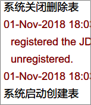
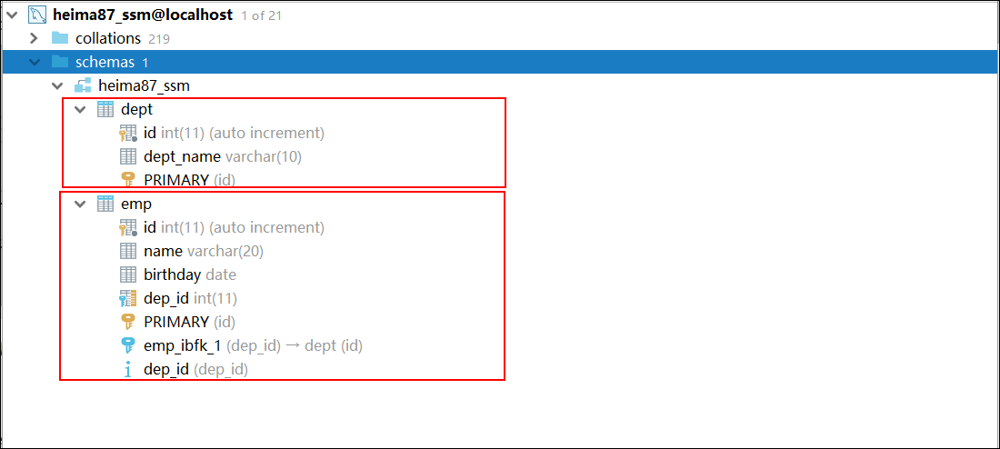
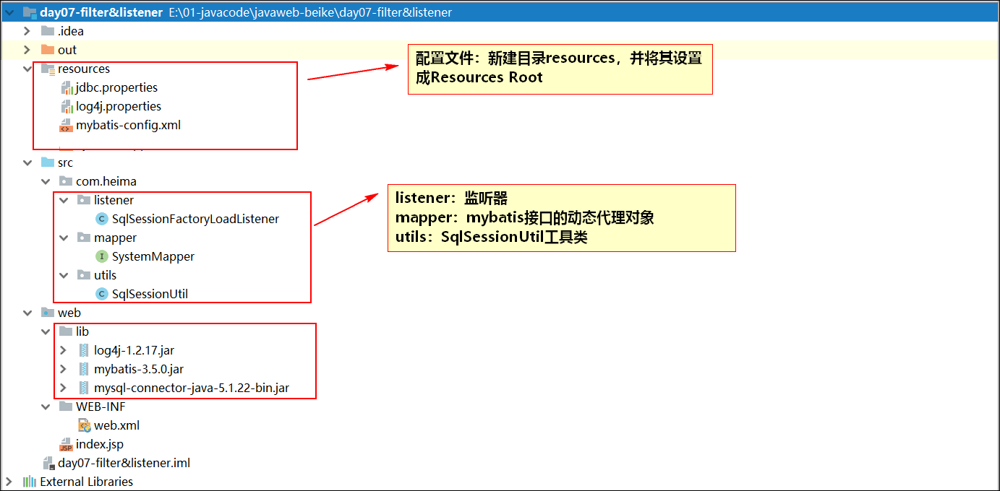
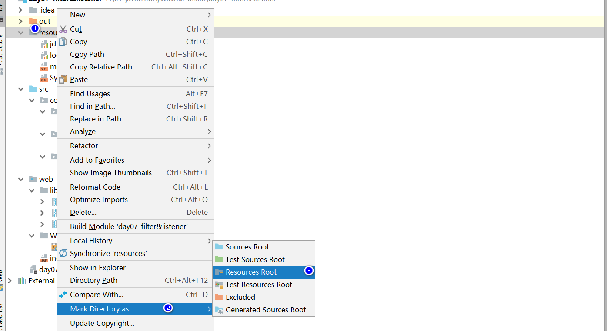
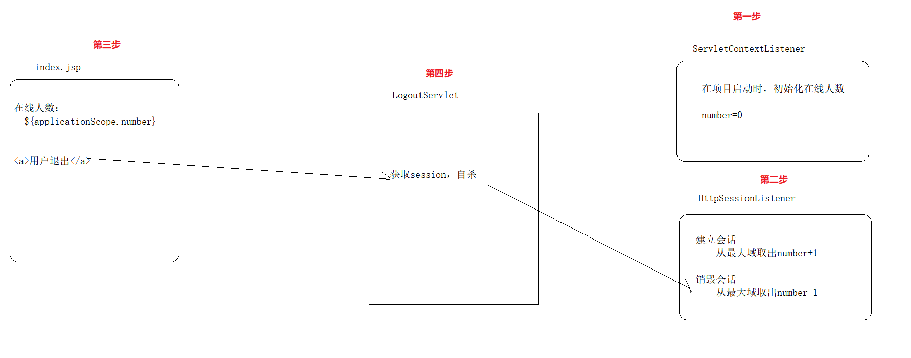

#   需求：用于一些系统的测试

项目一开始需要创建一些数据表，在项目的使用过程中会添加一些测试数据。使用完了以后，希望下一次测试打开的项目，还是一个全新的表。

~~~html
 1) 项目启动：创建新的空表
 2) 项目关闭：测试或使用完毕表以后，删除表。
~~~


## 2  执行效果

#### 2.1 控制台输出

 

#### 2.2 MySQL数据库

 


## 3  编写的类：

~~~html
1)工具类，得到工厂对象
2)SystemDao类，表的创建与销毁
3)MyServletContextListener类，调用SystemDao类 
~~~


## 4  项目结构



【注】设置目录为 Resources Root



说明：上述resources就是相当于src文件夹，专门用来存放配置文件的。

## 5 案例实现

#### 【1】环境搭建

mybatis-config.xml

~~~xml
<?xml version="1.0" encoding="UTF-8" ?>
<!DOCTYPE configuration
        PUBLIC "-//mybatis.org//DTD Config 3.0//EN"
        "http://mybatis.org/dtd/mybatis-3-config.dtd">
<configuration>
    <!--加载外部的配置文件-->
    <properties resource="db.properties"></properties>
    <!--别名-->
    <!--<typeAliases>
        <package name="com.itheima.sh.domain"></package>
    </typeAliases>-->
    <!--mybatis环境的配置
        一个核心配置文件，可以配置多个运行环境，default默认使用哪个运行环境
    -->
    <environments default="development">
        <!--通常我们只需要配置一个就可以了， id是环境的名字 -->
        <environment id="development">
            <!--事务管理器：由JDBC来管理-->
            <!--
                事务管理器type的取值：
                1. JDBC：由JDBC进行事务的管理
                2. MANAGED：事务由容器来管理，后期学习Spring框架的时候，所有的事务由容器管理
            -->
            <transactionManager type="JDBC"/>
            <!--数据源的配置：mybatis自带的连接池-->
            <!--
                数据源：
                1. POOLED：使用mybatis创建的连接池
                2. UNPOOLED：不使用连接池，每次自己创建连接
                3. JNDI：由服务器提供连接池的资源，我们通过JNDI指定的名字去访问服务器中资源。
            -->
            <dataSource type="POOLED">
                <property name="driver" value="${jdbc.driver}"/>
                <property name="url" value="${jdbc.url}"/>
                <property name="username" value="${jdbc.username}"/>
                <property name="password" value="${jdbc.password}"/>
            </dataSource>
        </environment>

    </environments>
    <!--映射器-->
    <mappers>
        <!--加载其它的映射文件 注：注解开发是点号-->
        <!-- <package name="com.itheima.sh.dao"></package>-->
        <!--加载其它的映射文件 注：不是点号-->
        <!--<mapper resource="org/mybatis/example/BlogMapper.xml"/>-->
        <!--
            加载其它的映射文件 xml形式
                包扫描方式加载mapper映射文件,说明：
                1. 要求mapper映射文件，与mapper接口要放在同一个目录
                2. 要求mapper映射文件的名称，与mapper接口的名称要一致
            -->
        <package name="com.itheima.sh.dao"></package>
    </mappers>
</configuration>
~~~

jdbc.properties

~~~properties
jdbc.driver=com.mysql.jdbc.Driver
jdbc.url=jdbc:mysql://localhost:3306/db3?allowMultiQueries=true
jdbc.username=root
jdbc.password=1234
~~~

<font color="red">【注】在url后面添加：**?allowMultiQueries=true**    允许一个statement中批量执行多条SQL语句，**并且每条SQL语句结尾需要添加`;`**。(一定记住)</font>

举例：

~~~java
@Update({"create table dept(id int primary key auto_increment, dept_name varchar(10));",
            "create table emp (id int primary key auto_increment, name varchar(20),birthday date, dep_id int);"})
    public void createTables();
~~~

**【创建表的sql语句】**

~~~sql
{"create table dept(id int primary key auto_increment, dept_name varchar(10));",
            "create table emp(id int primary key auto_increment, name varchar(20),birthday date, dep_id int);"}
~~~

#### 【2】编码

##### SystemMapper.java

~~~java
public interface SystemMapper {
    /**
     创建所有的表
     */
    @Update({"create table dept(id int primary key auto_increment, dept_name varchar(10));",
            "create table emp(id int primary key auto_increment, name varchar(20),birthday date, dep_id int);"})
    public void createTables();

    /*
     删除所有的表
    */
    @Update({"drop table emp;","drop table dept;"})
    public void dropTables();
}

~~~

**注意：执行DDL语句使用注解Update执行。**

##### SqlSessionUtil.java

~~~java
package com.itheima.sh.utils;

import org.apache.ibatis.io.Resources;
import org.apache.ibatis.session.SqlSession;
import org.apache.ibatis.session.SqlSessionFactory;
import org.apache.ibatis.session.SqlSessionFactoryBuilder;

import java.io.IOException;
import java.io.InputStream;

/**
 * @author tiansuo
 * @date 2019-11-12 10:02
 *  会话工厂工具类
        1. 通过静态方法得到一个工厂对象
        2. 通过静态方法得到会话对象
 *
 */
public class SessionFactoryUtils {
    //声明一个工厂对象
    private static SqlSessionFactory factory;
    //在静态代码块中创建会话工厂
    static {
        SqlSessionFactoryBuilder builder = new SqlSessionFactoryBuilder();
        //得到输入流
        try(InputStream inputStream = Resources.getResourceAsStream("mybatisConfig.xml");) {
            factory = builder.build(inputStream);
        } catch (IOException e) {
            e.printStackTrace();
        }
    }
    /**
     静态方法得到会话工厂
     */
    public static SqlSessionFactory getSessionFactory() {
        return factory;
    }
    /**
     得到会话对象
     */
    public static SqlSession getSession() {
        return factory.openSession();
    }
}

~~~


##### 监听器：

【代码】

~~~java
package com.itheima.sh.listener02;

import com.itheima.sh.dao.SystemMapper;
import com.itheima.sh.utils.SessionFactoryUtils;

import javax.servlet.ServletContextEvent;
import javax.servlet.ServletContextListener;
import javax.servlet.annotation.WebListener;

@WebListener
public class SqlSessionFactoryListener implements ServletContextListener {
    /*
        tomcat启动完成：创建表 调用SystemMapper的createTables方法
     */
    @Override
    public void contextInitialized(ServletContextEvent servletContextEvent) {
        SystemMapper mapper = SessionFactoryUtils.getSession().getMapper(SystemMapper.class);
        mapper.createTables();
        System.out.println("数据表创建成功。。。。");
    }
    /*
        tomcat关闭删除表
     */
    @Override
    public void contextDestroyed(ServletContextEvent servletContextEvent) {
        SystemMapper mapper = SessionFactoryUtils.getSession().getMapper(SystemMapper.class);
        mapper.dropTables();
        System.out.println("数据表删除成功。。。。");
    }
}

~~~

**注意：一定要使用注解@WebListener注册监听器，才可以在tomcat服务器启动的时候执行上述方法体中的内容。**


# 案例:统计在线人数

**需求**

有用户使用网站,在线人数就+1;用户退出网站,在线人数就-1


## 2.1 技术分析

使用 ServletContext域对象 存储在线总人数

使用 ServletContextListener监听器，在项目启动时，初始化总人数为0

使用 HttpSessionListener监听器，用户访问，人数+1，用户退出，人数-1

使用 LogoutServlet控制器，对当前会话的session销毁


## 2.2 需求分析

   

## 2.3 代码实现

##### ① InitNumberListener

```java
@WebListener
public class InitNumberListener implements ServletContextListener {

    @Override
    public void contextInitialized(ServletContextEvent servletContextEvent) {
        // 获取上下文域对象
        ServletContext servletContext = servletContextEvent.getServletContext();
        // 初始化在线人数
        servletContext.setAttribute("number", 0);
    }

    @Override
    public void contextDestroyed(ServletContextEvent servletContextEvent) {

    }
}
```


##### ② NumberChangeListener

```java
@WebListener
public class NumberChangeListener implements HttpSessionListener {

    // 会话建立，在线人数+1
    @Override
    public void sessionCreated(HttpSessionEvent httpSessionEvent) {
        // 获取session域对象
        HttpSession session = httpSessionEvent.getSession();
        // 获取上下文域对象
        ServletContext servletContext = session.getServletContext();
        // 取出在线人数
        Integer number = (Integer) servletContext.getAttribute("number");
        // +1
        servletContext.setAttribute("number", number + 1);
    }

    // 会话销毁，在线人数-1
    @Override
    public void sessionDestroyed(HttpSessionEvent httpSessionEvent) {
        // 获取session域对象
        HttpSession session = httpSessionEvent.getSession();
        // 获取上下文域对象
        ServletContext servletContext = session.getServletContext();
        // 取出在线人数
        Integer number = (Integer) servletContext.getAttribute("number");
        // -1
        servletContext.setAttribute("number", number - 1);
    }
}
```


##### ③ index.jsp

```jsp
<%@ page contentType="text/html;charset=UTF-8" language="java" %>
<html>
  <head>
    <title></title>
  </head>
  <body>
  <h3>listener知识学习</h3>

  <h5>在线人数：${applicationScope.number}</h5>
  <a href="/logoutServlet">用户退出</a>
  </body>
</html>

```


##### ④ LogoutServlet

```java
@WebServlet("/LogoutServlet")
public class LogoutServlet extends HttpServlet {

    protected void doGet(HttpServletRequest request, HttpServletResponse response) throws ServletException, IOException {
        this.doPost(request, response);
    }

    protected void doPost(HttpServletRequest request, HttpServletResponse response) throws ServletException, IOException {
        // 销毁session
        request.getSession().invalidate();

        response.getWriter().write("logout");
    }

}
```

