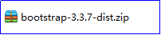
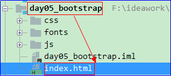
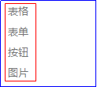
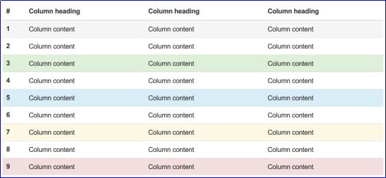

# Boostrap前端框架

## 第1章 Boostrap的概述

### 1 Boostrap的简介

什么是Boostrap框架：在现有的语言基础上，由第三方厂商美国[Twitter](https://baike.baidu.com/item/Twitter/2443267)公司开发的一些功能组件，可以提高开发效率，降低开发难度。我们就是学会使用这些框架来开发程序即可。

说明：由于我们学习的java是oracle公司的，所以第一方指的是oracle公司。作为学习java的我们，我们属于第二方。而第三方就是除了我们和oracle公司以外的公司，比如最为有名的第三方公司是Apache。

中文官网：www.bootcss.com


### 2 Bootstrap的作用

用于前端开发的框架

主要基于我们之前学习的HTML、CSS和JavaScript技术

### 3 Bootstrap的优势

移动设备优先：自 Bootstrap 3 起，框架包含了贯穿于整个库的移动设备优先的样式。

浏览器支持：Bootstrap支持所有的主流浏览器。如：Internet Explorer、 Firefox、 Opera、 Google Chrome、Safari。


容易上手：只要您具备 HTML 和 CSS 的基础知识，您就可以开始学习 Bootstrap。

响应式设计：Bootstrap 的响应式 CSS 能够自适应于台式机、平板电脑和手机。

### 4 响应式设计

#### 4.1 传统的网页

如： <https://m.jd.com> 手机版京东 

<https://m.taobao.com> 手机版淘宝

1、淘宝网站在电脑上的效果：


2、淘宝网站在手机上的效果：


#### 4.2 响应式设计

如：

索尼

~~~html
 http://www.sony.com
~~~

苹果中国：

~~~html
http://www.apple.com
~~~


1）苹果网站在电脑上的效果：


概念：一个网站能够兼容多个终端——而不是为每个终端做一个特定的版本，这个概念是为解决移动互联网浏览而诞生的。响应式布局可以为不同终端的用户提供更加舒适的界面和更好的用户体验。响应式布局基于HTML和CSS，才可以实现。

特点：一个网页可以自动适应设备的宽度，在手机，平板，电脑看到的是同一个页面。

说明：一般不会将一个非常复杂的网页作为响应式，如电脑版本的淘宝和京东。响应式一般应用于比较简单的网页。

在bootstrap中一共将设备分成四类：微型xs，小型sm，中型md，大型lg

## 第2章 Boostrap的使用

### 1 准备使用Bootstrap

#### 1.1 Boostrap下载

去官网下载即可：<http://www.bootcss.com>

下载用于生产环境的Bootstrap即可：

1）在浏览器地址栏中输入官网地址，进入官网：


2）选择 起步 


3）下载用于生产环境的Bootstrap


4）下载之后的BootStrap如下：



说明：直接解压压缩包即可，如下：


#### 1.2 Bootstrap的目录结构


1.设置全局 CSS 样式：基本的 HTML元素均可以通过 **class 设置样式并得到增强效果。**

2.JavaScript 插件：为 Bootstrap 的组件赋予了“生命”。

​	BootStrap使用JavaScript插件之后就是可以实现数据的交互。要不然数据无法交互，那么就是静态页面了。

3.组件：无数可复用的组件，包括字体图标、下拉菜单、导航、警告框、弹出框等更多功能。

```html
 Bootstrap：
  ├── css/  全局的CSS样式，把所有的标签重新定义了样式
  │   ├── bootstrap.css    样式文件，标准版
  │   ├── bootstrap.min.css  压缩版，我们开发的时候使用压缩版
  │   ├── bootstrap-theme.css  
  │   ├── bootstrap-theme.min.css    
  ├── js/  JavaScript的插件目录
  │   ├── bootstrap.js   
  │   └── bootstrap.min.js  导入这个JS文件
  └── fonts/ 字体图标，用于在网页上使用各种BootStrap提供的小图标，如果不用，这个文件夹可以不复制。
      ├── glyphicons-halflings-regular.eot
      ├── glyphicons-halflings-regular.svg
      ├── glyphicons-halflings-regular.ttf
      ├── glyphicons-halflings-regular.woff
      └── glyphicons-halflings-regular.woff2
```

#### 1.3 压缩版与标准版的区别

压缩版(min)与标准版的功能是一样的，压缩版文件更小，更省资源，加载速度更快。但是没有换行，没有注释，变量名都很短。只是阅读性比较差。

#### 1.4 目录下的字体图标


### 2 创建Bootstrap模板

#### 2.1 创建Bootstrap模板文件的步骤

1.只需要创建一次，以后可以直接复制这个模板使用

​	1)新创键一个静态Web项目day05_bootstrap。


​	2)将解压出来的三个文件夹css、js、fonts赋值到项目day05_bootstrap中。


​	 3)将课前资料中jQuery类库jquery-3.2.1.min.js文件复制到js文件夹下。


​	4)在day05_bootstrap项目下新创建一个HTML文件index.html。



​	5)将页面上"起步基本模板"代码复制到index.html中。

​	  说明：如果能够上网直接到主页找到起步，然后找到基本模板。


如果不能上网，找到课前资料，然后找到----》\Bootstrap离线文档\v3.bootcss.com----》进去之后找到index.htm使用浏览器打开。如下：


也可以打开，然后按照之前的操作就可以了。

将基本模板代码复制到自己新建的index.html后如下：


#### 2.2 模板的详细解释

```html
<!DOCTYPE html>
<html lang="zh-CN">
<!--指定为中文-中国-->
<head>
   <!-- 指定网页的字符集为utf-8-->
    <meta charset="utf-8">
    <!--使用微软最新的浏览器Edge的内核来解析当前的HTML文件，最新的浏览器都支持 -->
    <meta http-equiv="X-UA-Compatible" content="IE=edge">
   <!--
   响应式布局参数：
    viewport： 视口的参数
    width=device-width：默认的网页宽度是设备的宽度
    initial-scale=1: 初始的缩放比1：1
    -->
    <meta name="viewport" content="width=device-width, initial-scale=1">
    <!-- 上述3个meta标签*必须*放在最前面，任何其他内容都*必须*跟随其后！ -->
    <title>Bootstrap 101 Template</title>

    <!-- 1. 导入bootstrap的全局css样式  -->
    <link href="css/bootstrap.min.css" rel="stylesheet">
</head>
<body>
<h1>你好，世界！</h1>
<!-- 2. 导入 jQuery 框架 -->
<script src="js/jquery-3.2.1.min.js"></script>
<!-- 3. 导入bootstrap框架 -->
<script src="js/bootstrap.min.js"></script>
</body>
</html>
```

## 第3章 全局CSS样式

进入全局CSS样式后，我们选择页面中右侧的几个选项：



### 1 按钮

#### 1.1 按钮：普通按钮

可作为按钮使用的标签或元素，为 <a>、<button> 或 <input> 元素添加按钮类。


完成的效果：


代码如下：

```html
<div class="container">
    <h3>普通按钮</h3>
    <a href="#" class="btn btn-default">我是链接</a>
    <input type="button" class="btn btn-default" value="我是按钮"/>
    <button class="btn btn-default">也是按钮</button>
</div>
```

说明：如果不添加class属性，就和之前html中的样式一样，但是如果添加class属性之后，就会出现Bootstrap的上述样式。

#### 1.2 预定义样式的按钮： 

有不同颜色的按钮


效果：


#### 1.3 案例代码：

```html
<div class="container">
    <h3>预定义按钮</h3>
    <input type="button" class="btn btn-primary" value="我是首选项按钮"/>
    <input type="button" class="btn btn-success" value="我是成功按钮"/>
    <input type="button" class="btn btn-info" value="我是一般信息按钮"/>
</div>
```

### 2 表格

表格就是table，为任意 <table> 标签添加**table**类可以为其赋予基本的样式 ，可以完成对表格的美化。

接下来我们可以通过bootstrap主页中的全局CSS样式中的右侧表格来学习表格知识。


#### 2.1 与表格有关的类样式

| **表格的样式**                                 | **类名**，**class属性值** |
| ---------------------------------------------- | ------------------------- |
| **基本实例**                                   | **table**                 |
| **条纹状表格**，**就是隔行颜色有点类似斑马纹** | **table-striped**         |
| **带边框的表格**                               | **table-bordered**        |
| **鼠标悬停**                                   | **table-hover**           |

#### 2.2 表格中的状态类

 	即单独对某个td或tr设置不同的颜色，通过这些状态类可以为行或单元格设置颜色。

| **class属性值** | **描述**                                 |
| --------------- | ---------------------------------------- |
| **active**      | **鼠标悬停在行或单元格上时所设置的颜色** |
| **success**     | **标识成功或积极的动作，浅绿色**         |
| **info**        | **标识普通的提示信息或动作**             |
| **warning**     | **标识警告或需要用户注意**               |
| **danger**      | **标识危险或潜在的带来负面影响的动作**   |

#### 2.3 状态类的效果



#### 2.4 表格案例

1、案例需求：

 使用bootstrap制作如下所示的表格效果，支持响应式布局

2、案例效果：


3、案例代码：

步骤：

1）新创键一个html页面；

2）将之前的Bootstrap模板页面复制到上述创建好的html页面中；

3）在页面中添加一个div,class属性是container，同时添加一个标题标签：内容是表格；

4）根据案例效果图我们需要创建一个table表格，4行4列，第一行标题可以使用th;

5）首先给表格table的class属性值添加一个table类，然后添加table-striped表示条纹状，table-bordered表示表格边框，table-hover表示当鼠标悬停在表格上面会有效果；

6）最后给第一行的tr添加一个class属性，赋值为success。这样第一行就会变为绿色了。

```html
<div class="container">
    <h3>表格</h3>
    <table class="table table-striped table-bordered table-hover">
        <tr class="success">
            <th>编号</th>
            <th>编号</th>
            <th>编号</th>
        </tr>
        <tr>
            <td>1111</td>
            <td>1111</td>
            <td>1111</td>
        </tr>
        <tr>
            <td>1111</td>
            <td>1111</td>
            <td>1111</td>
        </tr>
        <tr>
            <td>1111</td>
            <td>1111</td>
            <td>1111</td>
        </tr>
    </table>
</div>
```


