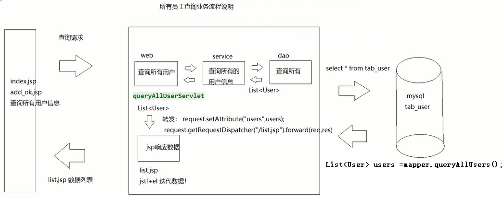

typora-copy-images-to: img

typora-copy-images-to: img

# day10-综合练习

## 学习目标

-[ ] 能够完成列表查询
-[ ] 能够完成修改用户的功能
-[ ] 能够完成删除指定用户的功能


## 第1章  web项目环境搭建

### 1、统一开发环境

统一开发环境是任何项目开发前必须要做的事情。因为企业中的开发都是团队开发，如果一个团队的成员开发环境不一致，很容易产生一些不必要的问题。所以，开发项目之前必须要统一开发环境。本次综合练习需要统一的开发环境有以下几项：

1. 开发工具---IntelliJ IDEA2017；
2. JDK--1.8;
3. Tomcat--8.5.31；
4. 数据库--MySQL 5.6；
5. Servlet--3.0；
6. SQLYog

### 2、使用IDEA创建web项目

#### 第一步：File--New--Project


#### 第二步：配置web项目


#### 第三步：使用模板


#### 第四步：配置web项目信息


#### 第五步：创建完成


#### 第六步：创建层与层之间关联的包结构


### 3、导入jar包、配置文件、实体类和工具类

#### 3.1jar包、配置文件和工具类说明

  **【 1这次综合练习需要用到以下jar包】**


**【2配置文件】**

   **mybatis核心配置文件：**

~~~xml
<?xml version="1.0" encoding="UTF-8" ?>
<!DOCTYPE configuration
        PUBLIC "-//mybatis.org//DTD Config 3.0//EN"
        "http://mybatis.org/dtd/mybatis-3-config.dtd">
<configuration>
    <!--加载外部的配置文件-->
    <properties resource="db.properties"></properties>
    <!--别名-->
    <typeAliases>
        <package name="com.itheima.sh.domain"></package>
    </typeAliases>
    <!--mybatis环境的配置
        一个核心配置文件，可以配置多个运行环境，default默认使用哪个运行环境
    -->
    <environments default="development">
        <!--通常我们只需要配置一个就可以了， id是环境的名字 -->
        <environment id="development">
            <!--事务管理器：由JDBC来管理-->
            <!--
                事务管理器type的取值：
                1. JDBC：由JDBC进行事务的管理
                2. MANAGED：事务由容器来管理，后期学习Spring框架的时候，所有的事务由容器管理
            -->
            <transactionManager type="JDBC"/>
            <!--数据源的配置：mybatis自带的连接池-->
            <!--
                数据源：
                1. POOLED：使用mybatis创建的连接池
                2. UNPOOLED：不使用连接池，每次自己创建连接
                3. JNDI：由服务器提供连接池的资源，我们通过JNDI指定的名字去访问服务器中资源。
            -->
            <dataSource type="POOLED">
                <property name="driver" value="${jdbc.driver}"/>
                <property name="url" value="${jdbc.url}"/>
                <property name="username" value="${jdbc.username}"/>
                <property name="password" value="${jdbc.password}"/>
            </dataSource>
        </environment>

    </environments>
    <!--映射器-->
    <mappers>
        <!--加载其它的映射文件 注：注解开发是点号-->
        <!-- <package name="com.itheima.sh.dao"></package>-->
        <!--加载其它的映射文件 注：不是点号-->
        <!--<mapper resource="org/mybatis/example/BlogMapper.xml"/>-->
        <!--
            加载其它的映射文件 xml形式
                包扫描方式加载mapper映射文件,说明：
                1. 要求mapper映射文件，与mapper接口要放在同一个目录
                2. 要求mapper映射文件的名称，与mapper接口的名称要一致
            -->
        <package name="com.itheima.sh.dao"></package>
    </mappers>
</configuration>
~~~

**db.properties**

~~~properties
jdbc.driver=com.mysql.jdbc.Driver
jdbc.url=jdbc:mysql://localhost:3306/usermanager
jdbc.username=root
jdbc.password=1234
~~~

**log4j.properties**

~~~properties
### 设置Logger输出级别和输出目的地 ###
log4j.rootLogger=debug, stdout

### 把日志信息输出到控制台 ###
log4j.appender.stdout=org.apache.log4j.ConsoleAppender
log4j.appender.stdout.Target=System.out
log4j.appender.stdout.layout=org.apache.log4j.SimpleLayout

~~~

**【会话工具类】**

~~~java
package com.itheima.sh.utils;

import org.apache.ibatis.io.Resources;
import org.apache.ibatis.session.SqlSession;
import org.apache.ibatis.session.SqlSessionFactory;
import org.apache.ibatis.session.SqlSessionFactoryBuilder;

import java.io.IOException;
import java.io.InputStream;

/**
 * @author tiansuo
 * @date 2019-11-12 10:02
 *  会话工厂工具类
        1. 通过静态方法得到一个工厂对象
        2. 通过静态方法得到会话对象
 *
 */
public class SessionFactoryUtils {
    //声明一个工厂对象
    private static SqlSessionFactory factory;
    //在静态代码块中创建会话工厂
    static {
        SqlSessionFactoryBuilder builder = new SqlSessionFactoryBuilder();
        //得到输入流
        try(InputStream inputStream = Resources.getResourceAsStream("mapConfig.xml");) {
            factory = builder.build(inputStream);
        } catch (IOException e) {
            e.printStackTrace();
        }
    }
    /**
     静态方法得到会话工厂
     */
    public static SqlSessionFactory getSessionFactory() {
        return factory;
    }
    /**
     得到会话对象
     */
    public static SqlSession getSession() {
        return factory.openSession();
    }
}
~~~

**【编码过滤器工具类】**

~~~java
package com.itheima.sh.utils;

import javax.servlet.*;
import javax.servlet.annotation.WebFilter;
import javax.servlet.http.HttpServletRequest;
import javax.servlet.http.HttpServletResponse;
import java.io.IOException;
/*
    对所有POST方法请求参数进行编码
 */
@WebFilter("/*")
public class EncodingFilter implements Filter {
    public void destroy() {
    }
    public void doFilter(ServletRequest req, ServletResponse resp, FilterChain chain) throws ServletException, IOException {
        HttpServletRequest request = (HttpServletRequest) req;
        HttpServletResponse response = (HttpServletResponse) resp;
        //如果是POST方法，就对汉字进行编码的操作
        request.setCharacterEncoding("utf-8");
        //处理响应乱码
        response.setContentType("text/html;charset=utf-8");
        chain.doFilter(request, response);
    }
    public void init(FilterConfig config) throws ServletException {
    }
}
~~~

#### 3.2 在WEB-INF下创建lib目录

​	jar包一般都会存放在WEB-INF目录下的lib目录中。由于IDEA的web项目模板没有帮我们提供这个目录。所有，我们需要手动在WEB-INF下创建lib目录。


#### 3.3  导入jar包

​	将jar包复制到lib目录，然后选中所有的jar包---鼠标右键---Add As Library


 

### 4、数据库环境准备

   数据库环境准备包括：

* 创建数据库；
* 创建数据表；
* mybatis配置文件配置；


#### 4.1 创建数据库

使用数据库客户端创建数据库user_manager。

 


#### 4.2 导入数据库脚本

可以将下发资料物理删除SQL文件夹中的sql文件直接拖入到上述创建好的数据库中。


也可以执行下面的sql语句。

```sql
DROP TABLE IF EXISTS `t_user`;
CREATE TABLE `t_user` (
  `id` int(11) NOT NULL AUTO_INCREMENT,
  `name` varchar(50) NOT NULL,
  `sex` varchar(50) NOT NULL,
  `age` int(11) NOT NULL,
  `address` varchar(50) NOT NULL,
  `qq` varchar(50) NOT NULL,
  `email` varchar(50) NOT NULL UNIQUE,
  PRIMARY KEY (`id`)
) ENGINE=InnoDB AUTO_INCREMENT=16 DEFAULT CHARSET=utf8;

-- ----------------------------
-- Records of t_user
-- ----------------------------
INSERT INTO `t_user` VALUES ('1', '霍建华', '男', '280', '广西', '766335435', 'zs@qq.com');
INSERT INTO `t_user` VALUES ('2', '李四', '男', '22', '广东', '243424242', 'ls@qq.com');
INSERT INTO `t_user` VALUES ('3', '王五', '女', '230', '广东', '474574574', 'ww@qq.com');
INSERT INTO `t_user` VALUES ('4', '赵六', '女', '28', '广东', '77777777', 'zl@qq.com');
INSERT INTO `t_user` VALUES ('5', '钱七', '女', '25', '湖南', '412132145', 'qq@qq.com');
INSERT INTO `t_user` VALUES ('7', '锁哥', '男', '18', '黑龙江', '361', '520@qq.com');
INSERT INTO `t_user` VALUES ('8', '关晓彤', '女', '22', '广东', '361', '361@qq.con');
INSERT INTO `t_user` VALUES ('9', '刘亦菲', '女', '28', '湖南', '362', '362@qq.com');
INSERT INTO `t_user` VALUES ('10', '柳岩', '女', '38', '广西', '363', '363@qq.com');
INSERT INTO `t_user` VALUES ('11', '鹿晗', '女', '300', '广西', '2250', '2250@qq.com');
INSERT INTO `t_user` VALUES ('12', '赵丽颖', '女', '28', '广西', '28', '28@qq.com');
INSERT INTO `t_user` VALUES ('13', '刘德华', '男', '53', '广东', '361', '53@qq.com');
INSERT INTO `t_user` VALUES ('14', '刘亦菲', '女', '28', '广东', '1122', '1122@qq.com');
INSERT INTO `t_user` VALUES ('15', '锁哥', '男', '18', '黑龙江', '111', '111@qq.com');
```


#### 4.3 创建与数据表对应的实体类

按照数据表中的字段创建：


【实体类】User.java

~~~java
package cn.itheima.domain;

/*
  `id` int(11) NOT NULL AUTO_INCREMENT,
  `name` varchar(50) NOT NULL,
  `sex` varchar(50) NOT NULL,
  `age` int(11) NOT NULL,
  `address` varchar(50) NOT NULL,
  `qq` varchar(50) NOT NULL,
  `email` varchar(50) NOT NULL,
 */
public class User {
    private int id;
    private String name;
    private String sex;
    private int age;
    private String address;
    private String qq;
    private String email;
    public User() {
    }

    public User(String name, String sex, int age, String address, String qq, String email) {
        this.name = name;
        this.sex = sex;
        this.age = age;
        this.address = address;
        this.qq = qq;
        this.email = email;
    }

    public int getId() {
        return id;
    }

    public void setId(int id) {
        this.id = id;
    }

    public String getName() {
        return name;
    }

    public void setName(String name) {
        this.name = name;
    }

    public String getSex() {
        return sex;
    }

    public void setSex(String sex) {
        this.sex = sex;
    }

    public int getAge() {
        return age;
    }

    public void setAge(int age) {
        this.age = age;
    }

    public String getAddress() {
        return address;
    }

    public void setAddress(String address) {
        this.address = address;
    }

    public String getQq() {
        return qq;
    }

    public void setQq(String qq) {
        this.qq = qq;
    }

    public String getEmail() {
        return email;
    }

    public void setEmail(String email) {
        this.email = email;
    }

    @Override
    public String toString() {
        return "User{" +
                "id=" + id +
                ", name='" + name + '\'' +
                ", sex='" + sex + '\'' +
                ", age=" + age +
                ", address='" + address + '\'' +
                ", qq='" + qq + '\'' +
                ", email='" + email + '\'' +
                '}';
    }
}

~~~


#### 4.4 测试数据库环境是否搭建成功

1、在测试包中创建一个测试类，在该类中使用mybatis到数据库中查询数据，并输出到控制台

```java
package com.itheima.sh.test;
import com.itheima.sh.dao.UserMapper;
import com.itheima.sh.domain.User;
import com.itheima.sh.utils.SessionFactoryUtils;
import org.apache.ibatis.session.SqlSession;
import java.util.List;
public class Test01 {
    public static void main(String[] args) {
        //获取session
        SqlSession session = SessionFactoryUtils.getSession();
        //获取接口对象
        UserMapper mapper = session.getMapper(UserMapper.class);
        //调用查询方法
        List<User> list = mapper.queryAllUsers();
        list.forEach(System.out::println);
    }
}
```

2、需要的dao层接口UserMapper


代码：

~~~java
package com.itheima.sh.dao;
import com.itheima.sh.domain.User;
import org.apache.ibatis.annotations.Select;
import java.util.List;
public interface UserMapper {
    @Select("select * from t_user")
    List<User> queryAllUsers();
}
~~~

3、效果


### 5、导入静态文件

​	将案例所需的静态文件复制到web目录。静态文件在下发的资料文件夹中。

**【注意】不要将静态文件复制到WEB-INF目录下，WEB-INF目录是不能够直接通过浏览器访问的。**

	

### 6、启动tomcat

#### 6.1 启动tomcat


#### 6.2 查看效果


**web项目搭建成功**

## 第2章 用户列表查询	

用户列表查询就是查询所有的用户信息，并将其展示在页面上。


### 1、列表查询业务流程分析

说明：当我们在主页index.jsp页面点击查询所有的用户信息时，是跳转到了list.jsp页面，代码如下：

```html
	<a
	  href="list.jsp" style="text-decoration:none;font-size:33px">查询所有用户信息
	</a>
```

而在list.jsp页面中，数据都是在页面中是固定的数据，而不是从数据库中查询出来的。而我们希望当在index.jsp点击按钮时是到数据库中查询用户信息，然后在list.jsp页面中显示所有的用户。具体的流程如下图所示：




### 2、代码实现

#### 2.1 修改index.jsp的查询链接

​	将查看所有用户信息的链接地址改成Servlet映射路径进行查询；

**温馨提示**：因为代码里面index.jsp里面的a标签路径被修改了，所以同学需要注意，最好将路径切换为：queryAllUser

这是**index.jsp**代码


```java
<div align="center">
  	<a
	  href="/queryAllUser" style="text-decoration:none;font-size:33px">查询所有用户信息
	</a>
  </div>
```

#### 2.2 创建包，编写后台代码

##### 1、在web包里面写servlet


##### 2、编写后台代码

【web层】QueryAllUserServlet.java

~~~java
@WebServlet("/queryAllUser")
public class QueryAllUserServlet extends HttpServlet {
    protected void doPost(HttpServletRequest request, HttpServletResponse response) throws ServletException, IOException {
        doGet(request, response);
    }
    protected void doGet(HttpServletRequest request, HttpServletResponse response) throws ServletException, IOException {
        //去查询所有用户信息
        UserService service = new UserService();
        //进行查询业务处理
        List<User> userList = service.queryAllUser();
        //将数据存request域对象中
        request.setAttribute("users",userList);
        //使用转发  list.jsp
        request.getRequestDispatcher("/list.jsp").forward(request,response);
    }
}

~~~

【service层】

UserService类：

~~~java
  public class UserService {
    public List<User> queryAllUser() {
        //获取session
        SqlSession session = SessionFactoryUtils.getSession();
        //获取接口对象
        UserMapper mapper = session.getMapper(UserMapper.class);
        //调用查询方法
        List<User> list = mapper.queryAllUsers();
        //返回list
        return list;
    }
}
~~~

【dao层】UserDao接口：

```java
public interface UserMapper {
    @Select("select * from t_user")
    List<User> queryAllUsers();
}
```


##### 3、前台页面取值

【数据展示】list.jsp

~~~jsp
<%@ taglib prefix="c" uri="http://java.sun.com/jsp/jstl/core" %>
<%@ page contentType="text/html;charset=UTF-8" language="java" %>
<!DOCTYPE html>
<!-- 网页使用的语言 -->
<html lang="zh-CN">
<head>
    <!-- 指定字符集 -->
    <meta charset="utf-8">
    <!-- 使用Edge最新的浏览器的渲染方式 -->
    <meta http-equiv="X-UA-Compatible" content="IE=edge">
    <!-- viewport视口：网页可以根据设置的宽度自动进行适配，在浏览器的内部虚拟一个容器，容器的宽度与设备的宽度相同。
    width: 默认宽度与设备的宽度相同
    initial-scale: 初始的缩放比，为1:1 -->
    <meta name="viewport" content="width=device-width, initial-scale=1">
    <!-- 上述3个meta标签*必须*放在最前面，任何其他内容都*必须*跟随其后！ -->
    <title>用户信息管理系统</title>

    <!-- 1. 导入CSS的全局样式 -->
    <link href="css/bootstrap.min.css" rel="stylesheet">
    <!-- 2. jQuery导入，建议使用1.9以上的版本 -->
    <script src="js/jquery-2.1.0.min.js"></script>
    <!-- 3. 导入bootstrap的js文件 -->
    <script src="js/bootstrap.min.js"></script>
    <style type="text/css">
        td, th {
            text-align: center;
        }
    </style>
</head>
<body>
<div class="container">
    <h3 style="text-align: center">用户信息列表</h3><br>
    <input id="keyword" type="text" name="keyword"><input class="btn btn-default btn-sm" type="button" value="搜索" onclick="searchKey()">
    <table border="1" class="table table-bordered table-hover">
        <tr class="success">
            <th>编号</th>
            <th>姓名</th>
            <th>性别</th>
            <th>年龄</th>
            <th>籍贯</th>
            <th>QQ</th>
            <th>邮箱</th>
            <th>操作</th>
        </tr>
        <c:forEach items="${users}" var="user">
        <tr>
            <td>${user.id}</td>
            <td>${user.name}</td>
            <td>${user.sex}</td>
            <td>${user.age}</td>
            <td>${user.address}</td>
            <td>${user.qq}</td>
            <td>${user.email}</td>
            <td>
                <a class="btn btn-default btn-sm" href="queryUserByID?id=${user.id}">修改</a>&nbsp;
                <a class="btn btn-default btn-sm" href="javascript:void(0)" onclick="deleteUserByID(${user.id})">删除</a></td>
        </tr>
        </c:forEach>
        <tr>
            <td colspan="8" align="center"><a class="btn btn-primary" href="add.jsp">添加联系人</a></td>
        </tr>
    </table>
</div>
</body>
</html>


~~~

**效果展示：** 展现的数据和数据库的数据一致


## 第3章   实现新增功能


### 1.新增用户需求

1. 将用户数据准确插入到数据库中；
2. 数据添加完成后list页面的数据及时更新；

【add.jsp】新增用户页面

```html
<%@ page contentType="text/html;charset=UTF-8" language="java" %>
<!-- HTML5文档-->
<!DOCTYPE html>
<!-- 网页使用的语言 -->
<html lang="zh-CN">
<head>
    <!-- 指定字符集 -->
    <meta charset="utf-8">
    <!-- 使用Edge最新的浏览器的渲染方式 -->
    <meta http-equiv="X-UA-Compatible" content="IE=edge">
    <!-- viewport视口：网页可以根据设置的宽度自动进行适配，在浏览器的内部虚拟一个容器，容器的宽度与设备的宽度相同。
    width: 默认宽度与设备的宽度相同
    initial-scale: 初始的缩放比，为1:1 -->
    <meta name="viewport" content="width=device-width, initial-scale=1">
    <!-- 上述3个meta标签*必须*放在最前面，任何其他内容都*必须*跟随其后！ -->
    <title>添加用户</title>

    <!-- 1. 导入CSS的全局样式 -->
    <link href="css/bootstrap.min.css" rel="stylesheet">
    <!-- 2. jQuery导入，建议使用1.9以上的版本 -->
    <script src="js/jquery-2.1.0.min.js"></script>
    <!-- 3. 导入bootstrap的js文件 -->
    <script src="js/bootstrap.min.js"></script>
</head>
<body>
<div class="container text-left">
    <center><h3>添加联系人页面</h3></center>
    <center><font color="red">${msg}</font></center>
    <form action="/addUser" method="post" class="form-horizontal">
        <div class="form-group">
            <label class="col-lg-2 control-label" for="name">姓名：</label>
           <div class="col-lg-8">
               <input type="text" class="form-control" id="name" name="name" placeholder="请输入姓名">
           </div>
            <label class="col-lg-2 control-label" id="nameMsg"></label>
        </div>

        <div class="form-group">
            <label class="col-lg-2 control-label">性别：</label>
            <div class="col-lg-3">
                <input type="radio" name="sex" value="男" checked="checked"/>男
            </div>
            <div class="col-lg-3">
                <input type="radio" name="sex" value="女"/>女
            </div>
            <label class="col-lg-2 control-label" id="sexMsg"></label>
        </div>

        <div class="form-group">
            <label for="age" class="control-label col-lg-2">年龄：</label>
            <div class="col-lg-8">
                <input type="text" class="form-control" id="age" name="age" placeholder="请输入年龄">
            </div>
        </div>

        <div class="form-group">
            <label for="jiguan" class="col-lg-2 control-label">籍贯：</label>
            <div class="col-lg-8">
                <select name="address" class="form-control" id="jiguan">
                    <option value="广东">广东</option>
                    <option value="广西">广西</option>
                    <option value="湖南">湖南</option>
                </select>
            </div>
        </div>

        <div class="form-group">
            <label for="qq" class="control-label col-lg-2">QQ：</label>
           <div class="col-lg-8">
               <input type="text" class="form-control" id="qq"  name="qq" placeholder="请输入QQ号码"/>
           </div>
        </div>

        <div class="form-group">
            <label for="email" class="col-lg-2 control-label">Email：</label>
           <div class="col-lg-8">
               <input type="text" class="form-control" id="email" name="email" placeholder="请输入邮箱地址"/>
           </div>
        </div>

        <div class="form-group" style="text-align: center">
            <input class="btn btn-primary" type="submit" value="提交" />
            <input class="btn btn-default" type="reset" value="重置" />
            <input class="btn btn-default" type="button" value="返回" />
        </div>
    </form>
</div>
</body>
</html>
```

### 2.代码

【AddUserServlet.java】Servlet代码

说明：我们接下来要实现将add.jsp页面中的所有用户输入的数据都要封装到User实体类中，但是如果我们使用

```java
String getParameter(String var1);
```

虽然可以完成将页面中的表单的数据封装到User的实体类中，但是这样会造成封装的代码会很多，所以我们可以使用Apache公司提供的一个工具类BeanUtils可以完成快速封装。所以接下来我们下学习下这个第三方的工具类：

#### 2.1、BeanUtils的概述

BeanUtils 是 Apache commons组件的成员之一，主要用于简化JavaBean封装数据的操作。它可以给JavaBean封装一个字符串数据，也可以将一个表单提交的所有数据封装到JavaBean中。

#### 2.2、需要的jar包


BeanUtils工具常用工具类：BeanUtils类。BeanUtils类用于封装数据的。

#### 2.3、BeanUtils的populate方法的使用(掌握)

将核心包导入idea的web文件夹下：


BeanUtils类中的static	populate(Object bean, Map<String,String[]> properties)方法    将Map数据封装到指定Javabean中，一般用于将表单的所有数据封装到javabean中。

对于两个参数进行解释：

Object bean ：表示JavaBean的实体类的对象，比如Person类的对象。

Map<String,String[]> properties：Map集合中存放的是大量的数据，Map中的key即String类型的要和JavaBean中的属性名一致，比如key可以是Person类中的id，name,password等。

Map集合的value即String[]类型的数组存放的就是Javabean中属性所需要的值。

总结：这样就可以将Map集合中的所有数据封装到Javabean中的属性中了.

#### 2.4、添加用户的servlet代码

代码演示如下：

```java
package com.itheima.sh.web;

import com.itheima.sh.domain.User;
import com.itheima.sh.service.UserService;
import org.apache.commons.beanutils.BeanUtils;

import javax.servlet.ServletException;
import javax.servlet.annotation.WebServlet;
import javax.servlet.http.HttpServlet;
import javax.servlet.http.HttpServletRequest;
import javax.servlet.http.HttpServletResponse;
import java.io.IOException;
@WebServlet("/addUser")
public class AddUserServlet extends HttpServlet {
    protected void doPost(HttpServletRequest request, HttpServletResponse response) throws ServletException, IOException {
        doGet(request, response);
    }
    protected void doGet(HttpServletRequest request, HttpServletResponse response) throws ServletException, IOException {
        //获取用户提交所有信息
        //解决中文乱码问题，过滤器已经处理了乱码，这里不用在处理了
//        request.setCharacterEncoding("utf-8");
        //获取数据并封装到User类中
        User u = new User();
        try {
            BeanUtils.populate(u,request.getParameterMap());
            //创建service层对象
            UserService userService = new UserService();
            //调用方法插入数据
            boolean boo = userService.addUser(u);
            //判断是否插入成功
            if(boo){
                //添加成功 add_ok.jsp
                response.sendRedirect("/add_ok.jsp");
            }else
            {
                //添加失败
                //邮箱重复
                request.setAttribute("msg","邮箱重复");
                request.getRequestDispatcher("/add.jsp").forward(request,response);
            }
        } catch (Exception e) {
            e.printStackTrace();
        }
    }
}
```

add_ok.jsp页面代码：

```jsp
<%@ page contentType="text/html;charset=UTF-8" language="java" %>
<!-- HTML5文档-->
<!DOCTYPE html>
<!-- 网页使用的语言 -->
<html lang="zh-CN">
<head>
    <!-- 指定字符集 -->
    <meta charset="utf-8">
    <!-- 使用Edge最新的浏览器的渲染方式 -->
    <meta http-equiv="X-UA-Compatible" content="IE=edge">
    <!-- viewport视口：网页可以根据设置的宽度自动进行适配，在浏览器的内部虚拟一个容器，容器的宽度与设备的宽度相同。
    width: 默认宽度与设备的宽度相同
    initial-scale: 初始的缩放比，为1:1 -->
    <meta name="viewport" content="width=device-width, initial-scale=1">
    <!-- 上述3个meta标签*必须*放在最前面，任何其他内容都*必须*跟随其后！ -->
    <title>添加用户成功</title>

    <!-- 1. 导入CSS的全局样式 -->
    <link href="css/bootstrap.min.css" rel="stylesheet">
    <!-- 2. jQuery导入，建议使用1.9以上的版本 -->
    <script src="js/jquery-2.1.0.min.js"></script>
    <!-- 3. 导入bootstrap的js文件 -->
    <script src="js/bootstrap.min.js"></script>
</head>
<body>
<div class="container text-left">
    <a href="/queryAllUser">查询添加结果</a><br>
    <a href="index.jsp">主页面</a>
</div>
</body>
</html>
```

**Service层:**

**UserService类：**

```java
 /*
    进行插入业务逻辑处理
    先查 后插
  */
public boolean addUser(User u) {
        //获取session
        SqlSession session = SessionFactoryUtils.getSession();
        //获取接口对象
        UserMapper mapper = session.getMapper(UserMapper.class);
    	//查询邮箱是否存在
        User user = mapper.queryEmail(u.getEmail());
        if (user == null){
            //没有重复邮箱  进行插入操作
//            dao.addUser(u);
            mapper.addUser(u);
            //提交事务
            session.commit();
            //关闭session
            session.close();
            return true;
        }else {
            //有重复邮箱
            return false;
        }
    }
```

**注意：别忘记提交事务。**

**Dao层**

**UserMapper接口**

```java
public interface UserMapper {
    @Select("select * from t_user")
    List<User> queryAllUsers();
	//根据邮箱查询用户
    @Select("select * from t_user where email=#{email}")
    User queryEmail(String email);
    //添加用户
    @Insert("insert into t_user values(NULL ,#{name},#{sex},#{age},#{address},#{qq},#{email})")
    void addUser(User u);
}
```

#### 2.5、对于将页面中的数据封装到User实体类的扩展(理解)

上述我们已经使用了BeanUtils类将页面中的所有的数据封装到User类中了，本身已经很简单了，代码如下：

```java
 User u = new User();
 BeanUtils.populate(u,request.getParameterMap());
 //使用通用方法
       // User user = CommonBeansUtils.populate(User.class, request);
```

但是上述做法和底层实现代码思想是有些不同，假设如果我们换成向商品实体类Product或者订单实体类Order中封装数据，那么我们都要创建实体类的对象。这里我们可以换一种实现方式，就是偏底层的写法思想。

我们可以定义一个工具类专门用来向各种实体类封装属性值数据的。并在工具类中定义静态方法进行封装数据，具体的代码如下：

```java
public class CommonUtils {
    //静态方法向实体类中封装数据
    public static <T> T commonPopulate(Class<T> clazz, HttpServletRequest request){
        T obj = null;
        //通过字节码对象创建实体类对象
        try {
            obj = clazz.newInstance();
            //将map集合中的数据封装到实体类中
            BeanUtils.populate(obj,request.getParameterMap());
        } catch (Exception e) {
            e.printStackTrace();
        }
        //返回对象
        return obj;
    }
}
```

servlet中的代码：

```java
@WebServlet("/addUser")
public class AddUserServlet extends HttpServlet {
    protected void doPost(HttpServletRequest request, HttpServletResponse response) throws ServletException, IOException {
        doGet(request, response);
    }
    protected void doGet(HttpServletRequest request, HttpServletResponse response) throws ServletException, IOException {
        try {
            User u = CommonUtils.commonPopulate(User.class, request);
            //创建service层对象
            UserService userService = new UserService();
            //调用方法插入数据
            boolean boo = userService.addUser(u);
            //判断是否插入成功
            if(boo){
                //添加成功
                response.sendRedirect("/add_ok.jsp");
            }else
            {
                //添加失败
                //邮箱重复
                request.setAttribute("msg","邮箱重复");
                request.getRequestDispatcher("/add.jsp").forward(request,response);
            }
        } catch (Exception e) {
            e.printStackTrace();
        }
    }
}
```


## 第4章  删除指定用户

### 1、删除分类

分为两类：

​	逻辑删除和物理删除。

在实际开发中基本都会有删除数据的需求，删除又分为逻辑删除和物理删除。下面说下二者的区别：

```
一、所谓的逻辑删除其实并不是真正的删除，而是在表中将对应的是否删除标识（isdelete）
或者说是状态字段（status）做修改操作。比如0是未删除，1是已经删除。在逻辑上数据是被删除的，但数据本身依然存在数据库中。
二、物理删除就是真正的从数据库中做删除操作了，对应的sql语句为 delete ... where ...做物理删除操作的数据将会不在数据库中了。
```

在开发中，由于有些数据非常重要，比如用户信息等数据(用户的联系方式)，需要进行删除时候，一般都是使用的逻辑删除，不会进行物理删除。

逻辑删除思路： 并非数据库级别删除，删除操作，更新表某一个标识字段。


isdelete 标识数据有效性  0 ：有效  , 1 ： 无效！

逻辑删除操作的sql ： update  t_user set isdelete = 1 where id = ?;

恢复用户 操作的sql： update t_user set isdelete = 0 where id = ?;

查询没有删除的用户信息： select * from t_user where isdelete = 0;

查询已经删除用户信息: select * from t_user where isdelete = 1;

逻辑删除准备：

t_user 添加字段 isdelete 。直接使用图形化界面工具SQLYog给t_user表中添加isdelete 字段即可。

1)选中t_user表，右键选择更改表。


2)最后一个字段email的下一行,然后添加数据即可。在添加的一行中输入字段名为isdelete,类型为int，长度是11，不为空，默认值是0.最后点击下面的Alter.


3）User实体类添加一个字段：

```java
 	private int isdelete=0;//  0 表示用户有效   1  删除用户
    public int getIsdelete() {
        return isdelete;
    }
    public void setIsdelete(int isdelete) {
        this.isdelete = isdelete;
    }
```

### 2、逻辑删除流程图解


【需求】

​	点击list.jsp页面上的删除按钮后，这条数据在数据库中的字段isdelete的值变为1，再次查询，页面上不再显示这条数据；

【需求分析】

a).点击删除按钮，删除当前的数据；
1. 怎么能够确定当前这条数据呢？【通过id】
2. id是在什么时候传递的呢？【点击按钮】
3. 怎么将数据库中的字段isdelete的值变为1？【mybatis】
4. 结论：点击删除按钮，将id传到后台，根据id删除页面数据；


### 3、修改删除按钮的链接

首先找到删除按键，按键代码存在于**list.jsp**页面


``` jsp
<a class="btn btn-default btn-sm" href="javascript:;" onclick="deleteUserById(${u.id})">删除</a>
```

让超链接去执行一个js函数，而不是去跳转到一个地址。

说明：为了防止用户有可能是误删除用户，所以我们在这里使用确认框来再次确认下，如果是真的想删除，则跳转到相应的servlet中。

``` js
<script type="text/javascript">
        //定义js函数，接收用户id
        function deleteUserById(id) {
            // alert(id);
            //弹出确认框
            var con = window.confirm("是否确认删除?");
            //判断
            if(con){
                //确认删除
                window.location.href = "deleteUserById?id=" + id;
            }
        }
</script> 
```

前端页面**list.jsp**完整代码如下：

``` html
<%@ taglib prefix="c" uri="http://java.sun.com/jsp/jstl/core" %>
<%@ page contentType="text/html;charset=UTF-8" language="java" %>
<!DOCTYPE html>
<!-- 网页使用的语言 -->
<html lang="zh-CN">
<head>
    <!-- 指定字符集 -->
    <meta charset="utf-8">
    <!-- 使用Edge最新的浏览器的渲染方式 -->
    <meta http-equiv="X-UA-Compatible" content="IE=edge">
    <!-- viewport视口：网页可以根据设置的宽度自动进行适配，在浏览器的内部虚拟一个容器，容器的宽度与设备的宽度相同。
    width: 默认宽度与设备的宽度相同
    initial-scale: 初始的缩放比，为1:1 -->
    <meta name="viewport" content="width=device-width, initial-scale=1">
    <!-- 上述3个meta标签*必须*放在最前面，任何其他内容都*必须*跟随其后！ -->
    <title>用户信息管理系统</title>

    <!-- 1. 导入CSS的全局样式 -->
    <link href="css/bootstrap.min.css" rel="stylesheet">
    <!-- 2. jQuery导入，建议使用1.9以上的版本 -->
    <script src="js/jquery-2.1.0.min.js"></script>
    <!-- 3. 导入bootstrap的js文件 -->
    <script src="js/bootstrap.min.js"></script>
    <style type="text/css">
        td, th {
            text-align: center;
        }
    </style>
</head>
<body>
<div class="container">
    <h3 style="text-align: center">用户信息列表</h3>
    <table border="1" class="table table-bordered table-hover">
        <tr class="success">
            <th>编号</th>
            <th>姓名</th>
            <th>性别</th>
            <th>年龄</th>
            <th>籍贯</th>
            <th>QQ</th>
            <th>邮箱</th>
            <th>操作</th>
        </tr>
       <c:forEach items="${users}" var="u">
            <tr>
                <td>${u.id}</td>
                <td>${u.name}</td>
                <td>${u.sex}</td>
                <td>${u.age}</td>
                <td>${u.address}</td>
                <td>${u.qq}</td>
                <td>${u.email}</td>
                <td><a class="btn btn-default btn-sm" href="update.jsp">修改</a>&nbsp;
                    <a class="btn btn-default btn-sm" href="javascript:;" onclick="deleteUserById(${u.id})">删除</a></td>
            </tr>
       </c:forEach>
        <tr>
            <td colspan="8" align="center"><a class="btn btn-primary" href="add.jsp">添加联系人</a></td>
        </tr>
    </table>
</div>
    <script type="text/javascript">
        //定义js函数，接收用户id
        function deleteUserById(id) {
            // alert(id);
            //弹出确认框
            var con = window.confirm("是否确认删除?");
            //判断
            if(con){
                //确认删除
                window.location.href = "/deleteUserById?id=" + id;
            }
        }
    </script>
</body>
</html>
```

web层代码：

```java
@WebServlet("/deleteUserById")
public class DeleteUserByIDServlet extends HttpServlet {
    protected void doPost(HttpServletRequest request, HttpServletResponse response) throws ServletException, IOException {
        doGet(request, response);
    }
    protected void doGet(HttpServletRequest request, HttpServletResponse response) throws ServletException, IOException {
        //获取用户ID
        int id = Integer.parseInt(request.getParameter("id"));
        //根据ID进行删除操作
        UserService service = new UserService();
        service.deleteUserByID(id);

        //跳转到一个中转页面 delete_ok.jsp
        response.sendRedirect("/delete_ok.jsp");
    }
}
```

补充：

delete_ok.jsp页面中的代码：

```jsp
<%@ page contentType="text/html;charset=UTF-8" language="java" %>
<!-- HTML5文档-->
<!DOCTYPE html>
<!-- 网页使用的语言 -->
<html lang="zh-CN">
<head>
    <!-- 指定字符集 -->
    <meta charset="utf-8">
    <!-- 使用Edge最新的浏览器的渲染方式 -->
    <meta http-equiv="X-UA-Compatible" content="IE=edge">
    <!-- viewport视口：网页可以根据设置的宽度自动进行适配，在浏览器的内部虚拟一个容器，容器的宽度与设备的宽度相同。
    width: 默认宽度与设备的宽度相同
    initial-scale: 初始的缩放比，为1:1 -->
    <meta name="viewport" content="width=device-width, initial-scale=1">
    <!-- 上述3个meta标签*必须*放在最前面，任何其他内容都*必须*跟随其后！ -->
    <title>删除成功</title>

    <!-- 1. 导入CSS的全局样式 -->
    <link href="css/bootstrap.min.css" rel="stylesheet">
    <!-- 2. jQuery导入，建议使用1.9以上的版本 -->
    <script src="js/jquery-2.1.0.min.js"></script>
    <!-- 3. 导入bootstrap的js文件 -->
    <script src="js/bootstrap.min.js"></script>
</head>
<body>
<div class="container text-left">
    <a href="/queryAllUser">查询删除结果</a><br>
    <a href="index.jsp">主页面</a>
</div>
</body>
</html>
```

**service层代码:**

实现类：

```java
/*
     根据ID进行删除
*/
public void deleteUserByID(int id) {
        //获取session
//        SqlSession session = SessionFactoryUtils.getSession();
//        //获取接口对象
//        UserMapper mapper = session.getMapper(UserMapper.class);
        mapper.deleteUserByID(id);
        session.commit();
        session.close();
    }
```

**注意：别忘记提交事务**

**dao层代码:**

接口：

```java
public interface UserMapper {
    @Update("update t_user set isdelete=1 where id=#{id}")
    void deleteUserByID(int id);
}
```

注意：

要删除的用户在数据表中的字段isdelete已经变为1，已经完成了逻辑删除。但是当我们再次查询数据的时候依然可以显示逻辑上已经删除的数据。原因是我们并没有修改查询所有的用户的sql语句，我们需要添加条件是isdelete等于0.代码如下所示：

```java
	@Select("select * from t_user where isdelete=0")
    List<User> queryAllUsers();
```

同时还得修改添加用户的语句：

```java
 @Insert("insert into t_user values(NULL ,#{name},#{sex},#{age},#{address},#{qq},#{email},0)")
 void addUser(User u);
```

## 第5章  修改指定数据

### 1、修改的业务逻辑

​	a:当点击修改的时候先去数据库中根据当前用户的id到数据库中查询该用户的信息，并显示在修改的页面update.jsp页面，我们将这个过程称为数据的回显。

​	b:然后我们对用户的数据进行修改，在修改页面中，我们可以对页面中的任意一项进行修改。

所以接下来我们要先完成数据的回显，然后在进行修改。


### 2、回显要修改的数据

回显数据的业务逻辑如下所示：


【需求】点击修改按钮后，将当前这条数据的信息展示在页面上。

【需求分析】

1. 点击按钮后，需要传递这个用户的id数据到后台；【超链接传值，Servlet接收数据】
2. 后台根据id查询到数据后，将数据展示在修改页面上；【根据id查询到数据后，转发到update.jsp,在update.jsp页面取数据】

**代码修改按钮：**


**【代码实现】** ： 

【queryUserById】QueryUserByIDServlet.java

~~~java
@WebServlet("/queryUserByID")
public class QueryUserByIDServlet extends HttpServlet {
    protected void doPost(HttpServletRequest request, HttpServletResponse response) throws ServletException, IOException {
        doGet(request, response);
    }
    protected void doGet(HttpServletRequest request, HttpServletResponse response) throws ServletException, IOException {
         //获取ID
        int id = Integer.parseInt(request.getParameter("id"));
        //根据ID进行查询
        UserService service = new UserService();
        User user = service.queryUserByID(id);
        //将user对象存放域对象中
        request.setAttribute("user",user);
        //转发 到 update.jsp
        request.getRequestDispatcher("/update.jsp").forward(request,response);
    }
}
~~~

Service层：

**【类：UserService】**

~~~java
  	/*
  		回显数据
    	根据ID查询用户
     */
     public User queryUserByID(int id) {
        //获取session
//        SqlSession session = SessionFactoryUtils.getSession();
//        //获取接口对象
//        UserMapper mapper = session.getMapper(UserMapper.class);
        User user = mapper.queryUserByID(id);
        return user;
    }
~~~

Dao层：

**【UserMapper】类：**

~~~java
/*
   	根据ID进行查询 回显数据
*/
 @Select("select * from t_user where id=#{id}")
 User queryUserByID(int id);
~~~


【update.jsp】将数据回显到**update.jsp**上

~~~html
<%@ page language="java" import="java.util.*" pageEncoding="UTF-8"%>
<%@ taglib uri="http://java.sun.com/jsp/jstl/core" prefix="c" %>
<%
String path = request.getContextPath();
String basePath = request.getScheme()+"://"+request.getServerName()+":"+request.getServerPort()+path+"/";
%>
<!DOCTYPE html>
<!-- 网页使用的语言 -->
<html lang="zh-CN">
    <head>
    	<base href="<%=basePath%>"/>
        <!-- 指定字符集 -->
        <meta charset="utf-8">
        <meta http-equiv="X-UA-Compatible" content="IE=edge">
        <meta name="viewport" content="width=device-width, initial-scale=1">
        <title>修改用户</title>

        <link href="css/bootstrap.min.css" rel="stylesheet">
        <script src="js/jquery-2.1.0.min.js"></script>
        <script src="js/bootstrap.min.js"></script>
        
    </head>
    <body>
        <div class="container" style="width: 400px;">
        <h3 style="text-align: center;">修改联系人</h3>
        <form action="/updateUserByID" method="post">
            <input type="hidden" value="${user.id}" name="id">

          <div class="form-group">
            <label for="name">姓名：</label>
            <input type="text" value="${user.name}" class="form-control" id="name" name="name" placeholder="请输入姓名" />
          </div>

          <div class="form-group">
            <label>性别：</label>
              <input type="radio" name="sex" value="男"
                      <c:if test="${user.sex == '男'}">checked="checked"</c:if>
              />男
                <input type="radio" name="sex" value="女"
                        <c:if test="${user.sex == '女'}">checked="checked"</c:if>
                />女
          </div>

          <div class="form-group">
            <label for="age">年龄：</label>
            <input type="text" value="${user.age}" class="form-control" id="age"  name="age" placeholder="请输入年龄" />
          </div>

          <div class="form-group">
            <label for="address" id="address">籍贯：</label>
             <select name="address" class="form-control" >
                <option value="广东"
                        <c:if test="${user.address=='广东'}">selected="selected"</c:if>
                >广东</option>
                <option value="广西"
                        <c:if test="${user.address=='广西'}">selected="selected"</c:if>
                >广西</option>
                <option value="湖南"
                        <c:if test="${user.address=='湖南'}">selected="selected"</c:if>
                >湖南</option>
            </select>
          </div>

          <div class="form-group">
            <label for="qq" id="qq">QQ：</label>
            <input type="text" value="${user.qq}" readonly="readonly" class="form-control" name="qq" placeholder="请输入QQ号码"/>
          </div>

          <div class="form-group">
            <label for="email" id="email">Email：</label>
            <input type="text" value="${user.email}" readonly="readonly" class="form-control" name="email" placeholder="请输入邮箱地址"/>
          </div>

             <div class="form-group" style="text-align: center">
                <input class="btn btn-primary" type="submit" value="提交" />
                <input class="btn btn-default" type="reset" value="重置" />
                <input class="btn btn-default" type="button" value="返回"/>
             </div>
        </form>
        </div>
    </body>
</html>
~~~

**说明：回显数据的页面对于QQ号和Email只读不能做修改。设置属性：readonly="readonly"**


### 3、保存修改后的数据

业务逻辑如下图所示：


【需求】将修改后的数据保存到数据库

1. 将修改后的数据传递到后台。进行更新   【更新操作】
2. 根据什么更新？【id】这个数据怎么传递？【id不需要显示在页面上，通过隐藏域传递值】


更新需要隐藏标签

```java
<input type="hidden" value="${user.id}" name="id">
```

**【代码实现】** 

【UpdateUserByIdServlet.java】web层

~~~java
@WebServlet("/updateUserByID")
public class UpdateUserByIDServlet extends HttpServlet {
    protected void doPost(HttpServletRequest request, HttpServletResponse response) throws ServletException, IOException {
        doGet(request, response);
    }

    protected void doGet(HttpServletRequest request, HttpServletResponse response) throws ServletException, IOException {
        //获取用户更新提交数据
        User user = CommonUtils.commonPopulate(User.class, request);

        //进行更新业务逻辑
        UserService service = new UserService();
        service.updateUserByID(user);
        //重定向到update_ok.jsp
        response.sendRedirect("/update_ok.jsp");
    }
}


~~~

update_ok.jsp页面的代码：

```jsp
<%@ page contentType="text/html;charset=UTF-8" language="java" %>
<!-- HTML5文档-->
<!DOCTYPE html>
<!-- 网页使用的语言 -->
<html lang="zh-CN">
<head>
    <!-- 指定字符集 -->
    <meta charset="utf-8">
    <!-- 使用Edge最新的浏览器的渲染方式 -->
    <meta http-equiv="X-UA-Compatible" content="IE=edge">
    <!-- viewport视口：网页可以根据设置的宽度自动进行适配，在浏览器的内部虚拟一个容器，容器的宽度与设备的宽度相同。
    width: 默认宽度与设备的宽度相同
    initial-scale: 初始的缩放比，为1:1 -->
    <meta name="viewport" content="width=device-width, initial-scale=1">
    <!-- 上述3个meta标签*必须*放在最前面，任何其他内容都*必须*跟随其后！ -->
    <title>修改用户成功</title>

    <!-- 1. 导入CSS的全局样式 -->
    <link href="css/bootstrap.min.css" rel="stylesheet">
    <!-- 2. jQuery导入，建议使用1.9以上的版本 -->
    <script src="js/jquery-2.1.0.min.js"></script>
    <!-- 3. 导入bootstrap的js文件 -->
    <script src="js/bootstrap.min.js"></script>
</head>
<body>
<div class="container text-left">
    <a href="/queryAllUser">查询修改结果</a><br>
    <a href="index.jsp">主页面</a>
</div>
</body>
</html>
```

CommonUtils代码：

```java
public class CommonUtils {
    //静态方法向实体类中封装数据
    public static <T> T commonPopulate(Class<T> clazz, HttpServletRequest request){
        T obj = null;
        //通过字节码对象创建实体类对象
        try {
            obj = clazz.newInstance();
            //将map集合中的数据封装到实体类中
            BeanUtils.populate(obj,request.getParameterMap());
        } catch (Exception e) {
            e.printStackTrace();
        }
        //返回对象
        return obj;
    }
}
```


**【Service层: UserService类】**

```java
//更新业务逻辑 
public void updateUserByID(User user) {
        //获取session
//        SqlSession session = SessionFactoryUtils.getSession();
//        //获取接口对象
//        UserMapper mapper = session.getMapper(UserMapper.class);
        mapper.updateUserByID(user);
        //提交事务
        session.commit();
        //关闭会话
        session.close();
    }
```

**【注意：别忘记提交事务】**

**【Dao层：UserDao类】**

```java
@Update("update t_user set name=#{name},sex=#{sex},age=#{age},address=#{address} where id = #{id}")
void updateUserByID(User user);
```


### 4、修改结束后，页面查看最新数据

``` java
//跳转到update_ok.jsp
response.sendRedirect("/update_ok.jsp");
```

## 第6章  分页查询(扩展，有难度，最后做)

### 1、为什么要用分页

​	页面数据太多，一页展示不完。


带有分页的页面： 


我们可以模拟百度的分页效果。可以控制在一页中显示固定的数据，如果到最后一页数据没有那么多了，那么就剩多少数据显示多少数据。

### 2、分页实现分析

​    页面上的分页数据展示可以分为两部分：

1. 分页数据：就是展示在数据表格中的数据，随着页码的变化而变化；
2. 分页条：控制分页的按钮；

**注意：**

**1.查询开始位置索引=（当前页码-1）*每页显示的数据个数**

**2.总页数=Math.ceil(数据库总行数*1.0/每页显示的数据个数)**

分页的具体实现思想如下图所示：


### 3、分页的实体类PageBean

由于数据库的数据要暂存在实体类中，所以我们这里引入实体类来进行暂存分页的数据。

说明：在PageBean中需要定义如下几个成员变量：

```java
 //每一页显示的数据
 private List<User> data;
 //每一页显示数据的条数
 private int pageSize;
 //当前页数
 private int curPage;
 //数据库中的数据总条数
 private int count;
 //总的页数 虽然可以计算出来，但是前端页面要使用，所以这里定义了成员变量
 private int totalPage;
```

整体代码如下所示：

```java
/*
    分页实体类，分页数据都存放到实体类中
 */
public class PageBean {
    //每一页显示的数据
    private List<User> data;
    //每一页显示数据的条数
    private int pageSize;
    //当前页数
    private int curPage;
    //数据库中的数据总条数
    private int count;
    //总的页数 虽然可以计算出来，但是前端页面要使用，所以这里定义了成员变量
    private int totalPage;
    /*
        定义方法获取索引
        起始索引= (当前页数-1)*每一页显示数据的条数
        startIndex =(curPage-1)*pageSize
     */
    public int getStartIndex(){
        return (curPage - 1) * pageSize;
    }
    //get 和 set方法

    public List<User> getData() {
        return data;
    }

    public void setData(List<User> data) {
        this.data = data;
    }

    public int getPageSize() {
        return pageSize;
    }

    public void setPageSize(int pageSize) {
        this.pageSize = pageSize;
    }

    public int getCurPage() {
        return curPage;
    }

    public void setCurPage(int curPage) {
        this.curPage = curPage;
    }

    public int getCount() {
        return count;
    }

    public void setCount(int count) {
        this.count = count;
    }
    /*
        总的页数：
        Math.ceil(总条数*1.0/每一页显示的数据的条数)
        Math.ceil(count*1.0/pageSize)
        说明：count*1.0 为了count变为小数，这样就可以保证count*1.0/pageSize最后的结果是小数
        然后使用 Math类中的ceil方法向上取整数即可获取到总的页数
     */
    public int getTotalPage() {
        return (int) Math.ceil(count*1.0/pageSize);
    }

    public void setTotalPage(int totalPage) {
        this.totalPage = totalPage;
    }

    @Override
    public String toString() {
        return "PageBean{" +
                "data=" + data +
                ", pageSize=" + pageSize +
                ", curPage=" + curPage +
                ", count=" + count +
                ", totalPage=" + totalPage +
                '}';
    }
}

```

说明：

```java
  /*
        总的页数：
        Math.ceil(总条数*1.0/每一页显示的数据的条数)
        Math.ceil(count*1.0/pageSize)
        说明：count*1.0 为了count变为小数，这样就可以保证count*1.0/pageSize最后的结果是小数
        然后使用 Math类中的ceil方法向上取整数即可获取到总的页数
     */
    public int getTotalPage() {
        return (int) Math.ceil(count*1.0/pageSize);
    }
```


### 4、分页数据实现(后台代码)

​	因为我们在页面上显示的数据，是从数据库中查询到的数据。所以，分页的实现最终还是依赖sql语句来实现。

#### 4.1 数据库实现分页查询

​	MySQL数据库为我们提供了一个关键字limit，可以帮助我们查询到我们想要的指定条数的数据。

【案例】limit实现分页数据查询

【需求】

1. 每页查询3条数据；
2. 分别查询第1页，第2页，第3页的数据；
3. 总结出规律；

【提示】limit语法

```sql
# limit n1,n2    关键字的用法:
# n1 起始索引，0表示数据表第一行；n2 每一次查询数据条数（从起始索引起，总共查询多少条数据）
select * from t_user limit n1,n2
```


【参考】：

```sql
# n2 每一次查询数据条数		  pageSize：每一页显示的数据条数

SELECT * FROM t_user LIMIT  0,3 ;#  第1(curPage)页    0-3     
SELECT * FROM t_user LIMIT  3,3;#   第2(curPage)页    3-3  起始索引=(2-1)*3
SELECT * FROM t_user LIMIT  6,3;#   第3(curPage)页    6-3    起始索引=(3-1)*3

结论1：startIndex(起始索引)=(curPage(第几页)-1)*pageSize(每一页显示的数据条数)

#pageSize：每一页显示的数据条数 
#count(总条数): SELECT count(*) from t_user;
结论2：totalPage(总的页数)=Math.ceil(count(总条数)*1.0/pageSize(每一页显示的数据的条数)
```

【结论】

1. 实现分页查询需要用到5个变量：

   1）当前页数：curPage；

   2）每页显示的数据条数：pageSize；

   3）查询时的起始索引：startIndex；

   4）数据库中的数据总条数count;

   5）每一页显示的数据 List<User>  data;

2. 当前页数curPage是页面上用户选择的。需要从前台传递过来；

3. 每页显示的数据条数：pageSize，可以由我们程序员指定；

4. 查询时的起始索引：startIndex= (curPage-1)*pageSize;

5. 数据库中的数据总条数count和每一页显示的数据 List<User>  data，由数据库查询的数据来提供;

6. totalPage(总的页数)=Math.ceil(count(总条数)*1.0/pageSize(每一页显示的数据的条数)；


#### 4.2 后台代码实现

【web层】PageBeanServlet

```java
@WebServlet("/pageBeanServlet")
public class PageBeanServlet extends HttpServlet {
    protected void doPost(HttpServletRequest request, HttpServletResponse response) throws ServletException, IOException {
        doGet(request, response);
    }
    protected void doGet(HttpServletRequest request, HttpServletResponse response) throws ServletException, IOException {
        //1.获取当前页数
        int curPage = Integer.parseInt(request.getParameter("curPage"));
        //2.每一页显示几条数据
        int pageSize = 3;
        //3.将数据传递到service层，并将最后分页的数据封装到PageBean中
        UserService userService = new UserService();
        //调用方法
        PageBean pageBean = userService.queryPageBean(curPage,pageSize);
        //将pageBean存储到request域对象中
        request.setAttribute("pb",pageBean);
        //转发到page.jsp页面
        request.getRequestDispatcher("/page.jsp").forward(request,response);
    }
}
```


**【service层】UserService类**

```java
//分页查询
public PageBean queryPageBean(int curPage, int pageSize) {
        //获取session
//        SqlSession session = SessionFactoryUtils.getSession();
//        //获取接口对象
//        UserMapper mapper = session.getMapper(UserMapper.class);
        //创建PageBean对象
        PageBean pb = new PageBean();
        //添加数据
        pb.setCurPage(curPage);
        pb.setPageSize(pageSize);
        //每一页显示的数据
        List<User> data = mapper.queryData(pb.getStartIndex(),pb.getPageSize());
        //放到PageBean中
        pb.setData(data);
        //数据库中的数据条数
        int count = mapper.queryCount();
        //放到PageBean中
        pb.setCount(count);
        //将PageBean返回给servlet
        return pb;
    }
```


**【dao层】UserMapper接口**

```java
public interface UserMapper {
    //分页查询 每一页显示的数据
    @Select("select * from t_user where isdelete = 0 limit #{startIndex},#{pageSize}")
    List<User> queryData(@Param("startIndex")int startIndex, @Param("pageSize")int pageSize);
    //数据库中的数据条数
    @Select("select count(*) from t_user where isdelete = 0")
    int queryCount();
}
```

说明：

isdelete的值是0表示没有被删除，是1表示被删除了。我们这里必须加条件否则就会将所有的数据都会查询出来。


### 5、分页的页面实现

#### 5.1 分页条数据分析


#### 5.2 页面取值

我们发现之前我们并没有提供page.jsp页面，所以我们先创建一个page.jsp页面，其实可以将list.jsp页面进行修改即可：

【每一页的数据】

```jsp
<table border="1" class="table table-bordered table-hover">
        <tr class="success">
            <th>编号</th>
            <th>姓名</th>
            <th>性别</th>
            <th>年龄</th>
            <th>籍贯</th>
            <th>QQ</th>
            <th>邮箱</th>
            <th>操作</th>
        </tr>
    	<%--${pb.data} 表示获取每一页的数据--%>
        <c:forEach items="${pb.data}" var="u">
            <tr>
                <td>${u.id}</td>
                <td>${u.name}</td>
                <td>${u.sex}</td>
                <td>${u.age}</td>
                <td>${u.address}</td>
                <td>${u.qq}</td>
                <td>${u.email}</td>
                <td><a class="btn btn-default btn-sm" href="/queryUserById?id=${u.id}">修改</a>&nbsp;
                    <a class="btn btn-default btn-sm" href="javascript:;" onclick="deleteUserById(${u.id})">删除</a></td>
            </tr>
        </c:forEach>
        <tr>
            <td colspan="8" align="center"><a class="btn btn-primary" href="add.jsp">添加联系人</a></td>
        </tr>
    </table>
```

【分页栏】

页面中并没有分页栏代码，我们可以使用下发的资料中的**分页组件.html**,将分页栏代码放到页面下面即可。然后对其进行修改以及判断。

```jsp
<%--分页栏--%>
    <nav>
        <ul class="pagination">
            <%-- 上一页 --%>
            <%--
                判断当前页是否等于1，如果等于1，不能点击上一页
            --%>
            <c:if test="${pb.curPage==1}">
                <li class="disabled">
                    <a href="#">
                        <span>&laquo;</span>
                    </a>
                </li>
            </c:if>
            <%--如果当前页不等于1，可以点击上一页，那么在当前页面上-1--%>
            <c:if test="${pb.curPage!=1}">
                <li>
                    <a href="/pageBeanServlet?curPage=${pb.curPage-1}">
                        <span>&laquo;</span>
                    </a>
                </li>
            </c:if>
            <%-- 页码显示区
                begin="1" 表示从第一页开始
                end="${pb.totalPage}" 表示最后一页
                var="n" 表示每一页
            --%>
            <c:forEach begin="1" end="${pb.totalPage}" var="n">
                <c:if test="${pb.curPage==n}">
                    <li class="active"><span style="background-color: blue">${n}</span></li>
                </c:if>
                <c:if test="${pb.curPage!=n}">
                    <li class="active"><a href="/pageBeanServlet?curPage=${n}">${n}</a></li>
                </c:if>
            </c:forEach>
            <%-- 下一页 --%>
            <%--
             判断当前页是否等于最后一页，如果等于，不能点击下一页
         --%>
            <c:if test="${pb.curPage==pb.totalPage}">
                <li class="disabled">
                    <a href="#">
                        <span>&raquo;</span>
                    </a>
                </li>
            </c:if>
            <%--如果当前页不等于最后一页，可以点击下一页，并且在当前页面上+1--%>
            <c:if test="${pb.curPage!=pb.totalPage}">
                <li>
                    <a href="/pageBeanServlet?curPage=${pb.curPage+1}">
                        <span>&raquo;</span>
                    </a>
                </li>
            </c:if>
        </ul>
    </nav>
```

【页面的实现效果】


**【page.jsp页面中所有的代码】**

~~~jsp
<%@ taglib prefix="c" uri="http://java.sun.com/jsp/jstl/core" %>
<%@ page contentType="text/html;charset=UTF-8" language="java" %>
<!DOCTYPE html>
<!-- 网页使用的语言 -->
<html lang="zh-CN">
<head>
    <!-- 指定字符集 -->
    <meta charset="utf-8">
    <!-- 使用Edge最新的浏览器的渲染方式 -->
    <meta http-equiv="X-UA-Compatible" content="IE=edge">
    <!-- viewport视口：网页可以根据设置的宽度自动进行适配，在浏览器的内部虚拟一个容器，容器的宽度与设备的宽度相同。
    width: 默认宽度与设备的宽度相同
    initial-scale: 初始的缩放比，为1:1 -->
    <meta name="viewport" content="width=device-width, initial-scale=1">
    <!-- 上述3个meta标签*必须*放在最前面，任何其他内容都*必须*跟随其后！ -->
    <title>用户信息管理系统</title>

    <!-- 1. 导入CSS的全局样式 -->
    <link href="css/bootstrap.min.css" rel="stylesheet">
    <!-- 2. jQuery导入，建议使用1.9以上的版本 -->
    <script src="js/jquery-2.1.0.min.js"></script>
    <!-- 3. 导入bootstrap的js文件 -->
    <script src="js/bootstrap.min.js"></script>
    <style type="text/css">
        td, th {
            text-align: center;
        }
    </style>
</head>
<body>
<div class="container">
    <h3 style="text-align: center">用户信息列表</h3>
    <table border="1" class="table table-bordered table-hover">
        <tr class="success">
            <th>编号</th>
            <th>姓名</th>
            <th>性别</th>
            <th>年龄</th>
            <th>籍贯</th>
            <th>QQ</th>
            <th>邮箱</th>
            <th>操作</th>
        </tr>
        <c:forEach items="${pb.data}" var="u">
            <tr>
                <td>${u.id}</td>
                <td>${u.name}</td>
                <td>${u.sex}</td>
                <td>${u.age}</td>
                <td>${u.address}</td>
                <td>${u.qq}</td>
                <td>${u.email}</td>
                <td>
                    <a class="btn btn-default btn-sm" href="/queryUserByID?id=${u.id}">修改</a>&nbsp;
                    <a class="btn btn-default btn-sm" href="javascript:void(0)" onclick="deleteUserById(${u.id})">删除</a></td>
            </tr>
        </c:forEach>
        <tr>
            <td colspan="8" align="center"><a class="btn btn-primary" href="add.jsp">添加联系人</a></td>
        </tr>
    </table>
    <%--分页栏--%>
    <nav>
        <ul class="pagination">
            <%-- 上一页 --%>
            <%--
                判断当前页是否等于1，如果等于1，不能点击上一页
            --%>
            <c:if test="${pb.curPage==1}">
                <li class="disabled">
                    <a href="#">
                        <span>&laquo;</span>
                    </a>
                </li>
            </c:if>
            <%--如果当前页不等于1，可以点击上一页，那么在当前页面上-1--%>
            <c:if test="${pb.curPage!=1}">
                <li>
                    <a href="/pageBeanServlet?curPage=${pb.curPage-1}">
                        <span>&laquo;</span>
                    </a>
                </li>
            </c:if>
            <%-- 页码显示区
                begin="1" 表示从第一页开始
                end="${pb.totalPage}" 表示最后一页
                var="n" 表示每一页
            --%>
            <c:forEach begin="1" end="${pb.totalPage}" var="n">
                <c:if test="${pb.curPage==n}">
                    <li class="active"><span style="background-color: blue">${n}</span></li>
                </c:if>
                <c:if test="${pb.curPage!=n}">
                    <li class="active"><a href="/pageBeanServlet?curPage=${n}">${n}</a></li>
                </c:if>
            </c:forEach>
            <%-- 下一页 --%>
            <%--
             判断当前页是否等于最后一页，如果等于，不能点击下一页
         --%>
            <c:if test="${pb.curPage==pb.totalPage}">
                <li class="disabled">
                    <a href="#">
                        <span>&raquo;</span>
                    </a>
                </li>
            </c:if>
            <%--如果当前页不等于最后一页，可以点击下一页，并且在当前页面上+1--%>
            <c:if test="${pb.curPage!=pb.totalPage}">
                <li>
                    <a href="/pageBeanServlet?curPage=${pb.curPage+1}">
                        <span>&raquo;</span>
                    </a>
                </li>
            </c:if>
        </ul>
    </nav>
</div>
<script type="text/javascript">
    //定义js函数，接收用户id
    function deleteUserById(id) {
        // alert(id);
        //弹出确认框
        var con = window.confirm("是否确认删除?");
        //判断
        if(con){
            //确认删除
            window.location.href = "/deleteUserById?id=" + id;
        }
    }
</script>
</body>
</html>
~~~


#### 5.3 改变首页的请求链接

​	将首页的查询链接改成分页查询的链接即可。默认curPage当前页是1.

```jsp
<div align="center">
  	<a
	  <%--href="queryAllUser" style="text-decoration:none;font-size:33px">查询所有用户信息--%>
	  href="/pageBeanServlet?curPage=1" style="text-decoration:none;font-size:33px">查询所有用户信息
	</a>
  </div>

```


## 第7章.综合案例_登录

### 1.分析

需求：只有登录才可以访问主页，查看联系人信息以及添加联系人等。

思路：只要访问主页,使用过滤器拦截index.jsp,从session中获取用户对象，如果用户没有登录，则不能访问，跳转到登录页面。

只有登录才可以访问index.jsp页面。

sql语句：

~~~sql
create table user(
	id int primary key auto_increment,
	username varchar(50) not null unique,
	password varchar(50) not null unique
);

insert into user values(null,'admin','1234');
~~~


### 2.代码实现

#### 1.login.jsp

~~~jsp
<%@ page language="java" import="java.util.*" pageEncoding="UTF-8"%>
<%
String path = request.getContextPath();
String basePath = request.getScheme()+"://"+request.getServerName()+":"+request.getServerPort()+path+"/";
%>

<!DOCTYPE html> 
<html lang="zh-CN">
  <head>
  	<base href="<%=basePath%>"/>
    <meta charset="utf-8"/>
    <meta http-equiv="X-UA-Compatible" content="IE=edge"/>
    <meta name="viewport" content="width=device-width, initial-scale=1"/>
    <title>管理员登录</title>

    <!-- 1. 导入CSS的全局样式 -->
    <link href="css/bootstrap.min.css" rel="stylesheet">
    <!-- 2. jQuery导入，建议使用1.9以上的版本 -->
    <script src="js/jquery-2.1.0.min.js"></script>
    <!-- 3. 导入bootstrap的js文件 -->
    <script src="js/bootstrap.min.js"></script>
    <script type="text/javascript">
    </script>
  </head>
  <body>
  	<div class="container" style="width: 400px;">
  		<h3 style="text-align: center;">管理员登录</h3>
		<font color="red">${requestScope.msg}</font>
        <form action="/loginServlet" method="post">
	      <div class="form-group">
	        <label for="user">用户名：</label>
	        <input type="text" name="username" class="form-control" id="user" placeholder="请输入用户名"/>
	      </div>
	      
	      <div class="form-group">
	        <label for="password">密码：</label>
	        <input type="password" name="password" class="form-control" id="password" placeholder="请输入密码"/>
	      </div>

	      <hr/>
	      <div class="form-group" style="text-align: center;">
	        <input class="btn btn btn-primary" type="submit" value="登录">
	       </div>
	  	</form>
		
		<!-- 出错显示的信息框 -->
	  	<%--<div class="alert alert-warning alert-dismissible" role="alert">
		  <button type="button" class="close" data-dismiss="alert" >
		  	<span>&times;</span></button>
		   <strong>登录失败!</strong>
		</div>--%>
  	</div>
  </body>
</html>
~~~


#### 2.web层

~~~java
package com.itheima.sh.web;

import com.itheima.sh.pojo.User;
import com.itheima.sh.pojo.User2;
import com.itheima.sh.service.UserService;
import com.itheima.sh.util.CommonUtils;

import javax.servlet.ServletException;
import javax.servlet.annotation.WebServlet;
import javax.servlet.http.HttpServlet;
import javax.servlet.http.HttpServletRequest;
import javax.servlet.http.HttpServletResponse;
import java.io.IOException;

@WebServlet("/loginServlet")
public class LoginServlet extends HttpServlet {
    protected void doPost(HttpServletRequest request, HttpServletResponse response) throws ServletException, IOException {
        doGet(request, response);
    }

    protected void doGet(HttpServletRequest request, HttpServletResponse response) throws ServletException, IOException {

        try {
            //1.获取请求数据封装到实体类对象中
            User2 user2 = CommonUtils.populate(User2.class, request);
            //2.创建业务层对象
            UserService service = new UserService();
            //3.使用业务层对象调用方法将User对象传递到业务层 User u = service.login(user);
            User2 u = service.login(user2);
            //4.判断u是否等于null
            if(u==null){
                //5.如果等于null,说明没有用户，提示用户名或者密码错误，跳转到login.jsp
                request.setAttribute("msg","用户名或者密码错误");
                //转发
                request.getRequestDispatcher("/login.jsp").forward(request,response);
            }else{
                //6.不等于null,说明存在用户名和密码,登录成功，跳转到主页
                //将用户信息放到session中
                request.getSession().setAttribute("u",u);
                response.sendRedirect("/index.jsp");
            }
        } catch (Exception e) {
            e.printStackTrace();
        }
    }
}

~~~

#### 3.业务层

~~~java
 //超级管理员登录方法
    public User2 login(User2 user2) {
        // 1.获取session对象
        SqlSession session = SessionFactoryUtils.getSession();
        // 2.获取接口代理对象
        UserMapper mapper = session.getMapper(UserMapper.class);
        // 3.使用代理对象mapper调用登录方法
        User2 u = mapper.login(user2);
        return u;
    }
~~~

#### 4.dao层

~~~java
//登录方法
    @Select("select * from user where username=#{username} and password=#{password}")
    User2 login(User2 user2);
~~~

#### 5.登录过滤器

~~~java
package com.itheima.sh.filter;

import com.itheima.sh.pojo.User2;

import javax.servlet.*;
import javax.servlet.annotation.WebFilter;
import javax.servlet.http.HttpServletRequest;
import javax.servlet.http.HttpServletResponse;
import javax.servlet.http.HttpSession;
import java.io.IOException;

@WebFilter("/index.jsp")
public class LoginFilter implements Filter {
    public void destroy() {
    }

    public void doFilter(ServletRequest req, ServletResponse resp, FilterChain chain) throws ServletException, IOException {
        HttpServletRequest request = (HttpServletRequest) req;
        HttpServletResponse response = (HttpServletResponse) resp;
        //1.获取session中的用户名
        HttpSession session = request.getSession();
        //2.使用session对象调用方法从session中获取用户
        User2 u = (User2) session.getAttribute("u");
        //3.判断u是否等于null
        if(u==null){
            //4.说明用户没有登录，不能访问index.jsp,跳转到登录页面
            response.sendRedirect("/login.jsp");
        }else{
            //说明登录了，可以访问index.jsp 放行
            chain.doFilter(request, response);
        }
    }
    public void init(FilterConfig config) throws ServletException {

    }

}

~~~

#### 6.实体类

~~~java
package com.itheima.sh.pojo;
/*
    实体类：存储超级管理员
 */
public class User2 {
    private Integer id;
    private String username;
    private String password;

    public User2() {
    }

    public Integer getId() {
        return id;
    }

    public void setId(Integer id) {
        this.id = id;
    }

    public String getUsername() {
        return username;
    }

    public void setUsername(String username) {
        this.username = username;
    }

    public String getPassword() {
        return password;
    }

    public void setPassword(String password) {
        this.password = password;
    }

    @Override
    public String toString() {
        return "User2{" +
                "id=" + id +
                ", username='" + username + '\'' +
                ", password='" + password + '\'' +
                '}';
    }
}

~~~


## 今日小结

1.增删改查的后台代码非常重要，要求大家掌握后台三层架构加接口情况下的增删改查的代码编写。


