# day10-综合练习

## 1.介绍

就是实现联系人管理系统的增删改查。

## 2.步骤：

1.创建web项目

2.搭建后台环境

3.搭建前台环境

4.测试环境

5.查询所有联系人

6.增加联系人

7.删除联系人

8.修改联系人

9.分页查询联系人

10.登录功能

## 3.创建web项目

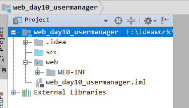

## 4.搭建后台环境

### 4.1数据库环境

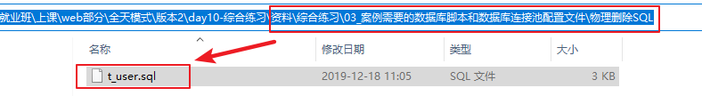

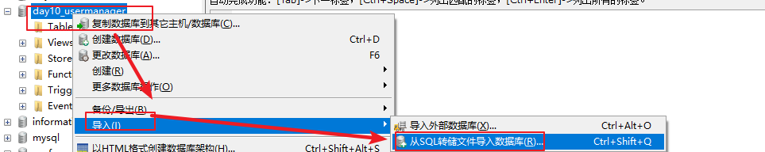

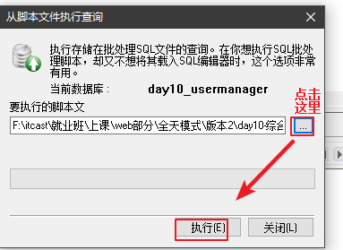

### 4.2导入项目依赖的第三方jar包

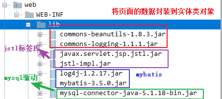

### 4.3配置文件

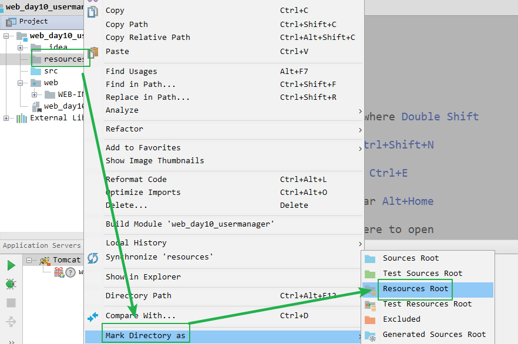

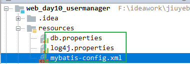

### 4.4 创建层次包

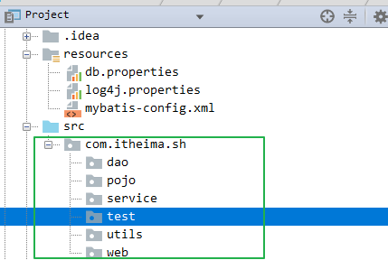

### 4.5工具类

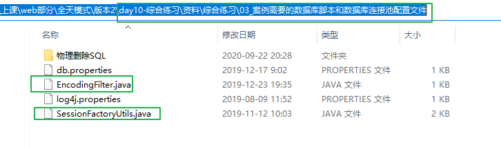

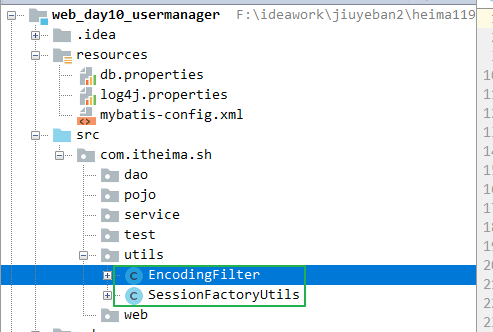

## 5.搭建前台环境

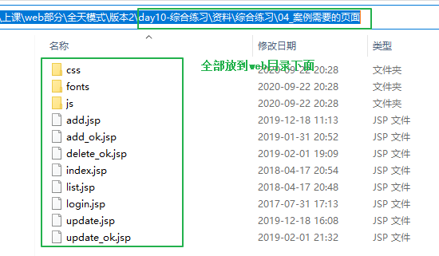

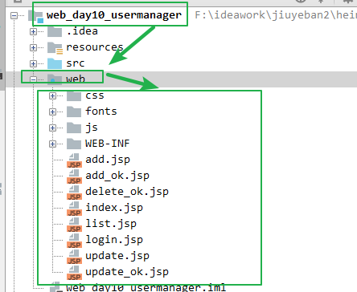

## 6.测试环境

【1】测试类

~~~java
package com.itheima.sh.test;
import com.itheima.sh.utils.SessionFactoryUtils;
import org.apache.ibatis.session.SqlSession;
import org.junit.Test;
public class UserManagerTest { 
    @Test
    public void queryAllUsers(){
        //1.根据mybatis工具类调用方法获取mybati的会话对象
        SqlSession session = SessionFactoryUtils.getSession();
        //2.使用mybatis的会话对象调用方法获取接口的动态代理对象
        UserMapper mapper = session.getMapper(UserMapper.class);
        //3.使用接口的代理对象调用查询所有用户方法将所有用户放到List集合中
        List<User> list = mapper.queryAllUsers();
        //4.输出list
        System.out.println("list = " + list);
    }
}
~~~

【2】实体类User

~~~java
package com.itheima.sh.pojo;

public class User {
    //成员变量
    private Integer id;
    private String  name;
    private String sex;
    private Integer age;
    private String address;
    private String qq;
    private String email;
    //构造方法

    public User() {
    }

    //成员方法

    public Integer getId() {
        return id;
    }

    public void setId(Integer id) {
        this.id = id;
    }

    public String getName() {
        return name;
    }

    public void setName(String name) {
        this.name = name;
    }

    public String getSex() {
        return sex;
    }

    public void setSex(String sex) {
        this.sex = sex;
    }

    public Integer getAge() {
        return age;
    }

    public void setAge(Integer age) {
        this.age = age;
    }

    public String getAddress() {
        return address;
    }

    public void setAddress(String address) {
        this.address = address;
    }

    public String getQq() {
        return qq;
    }

    public void setQq(String qq) {
        this.qq = qq;
    }

    public String getEmail() {
        return email;
    }

    public void setEmail(String email) {
        this.email = email;
    }

    @Override
    public String toString() {
        return "User{" +
                "id=" + id +
                ", name='" + name + '\'' +
                ", sex='" + sex + '\'' +
                ", age=" + age +
                ", address='" + address + '\'' +
                ", qq='" + qq + '\'' +
                ", email='" + email + '\'' +
                '}';
    }
}

~~~

【3】UserMapper接口

~~~java
package com.itheima.sh.dao;

import com.itheima.sh.pojo.User;
import org.apache.ibatis.annotations.Select;

import java.util.List;

public interface UserMapper {
    //1.查询所有用户的方法
    @Select("select * from t_user")
    List<User> queryAllUsers();
}

~~~

## 7.查询所有联系人

### 7.1流程分析

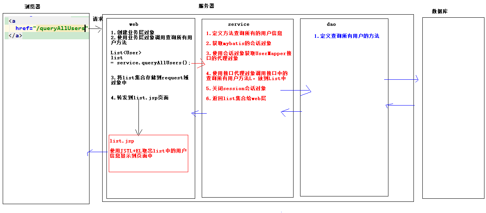

### 7.2代码实现

#### 1.dao层

~~~java
package com.itheima.sh.dao;

import com.itheima.sh.pojo.User;
import org.apache.ibatis.annotations.Select;

import java.util.List;

public interface UserMapper {
    //1.查询所有用户的方法
    @Select("select * from t_user")
    List<User> queryAllUsers();
}

~~~

#### 2.service层

~~~java
package com.itheima.sh.service;

import com.itheima.sh.dao.UserMapper;
import com.itheima.sh.pojo.User;
import com.itheima.sh.utils.SessionFactoryUtils;
import org.apache.ibatis.session.SqlSession;

import java.util.List;

public class UserService {
    //1.定义方法查询所有的用户信息
    public List<User> queryAllUsers() {
        //2.获取mybatis的会话对象
        SqlSession session = SessionFactoryUtils.getSession();

        //3.使用会话对象获取UserMapper接口的代理对象
        UserMapper mapper = session.getMapper(UserMapper.class);

        //4.使用接口代理对象调用接口中的查询所有用户方法，放到List中
        List<User> userList = mapper.queryAllUsers();

        //5. 关闭session会话对象
        session.close();

        //6. 返回list集合给web层
        return userList;
    }
}
~~~

#### 3.web层

~~~java
package com.itheima.sh.web;

import com.itheima.sh.pojo.User;
import com.itheima.sh.service.UserService;

import javax.servlet.ServletException;
import javax.servlet.annotation.WebServlet;
import javax.servlet.http.HttpServlet;
import javax.servlet.http.HttpServletRequest;
import javax.servlet.http.HttpServletResponse;
import java.io.IOException;
import java.util.List;

@WebServlet("/queryAllUsers")
public class QueryAllUsersServlet extends HttpServlet {
    protected void doPost(HttpServletRequest request, HttpServletResponse response) throws ServletException, IOException {
        doGet(request, response);
    }

    protected void doGet(HttpServletRequest request, HttpServletResponse response) throws ServletException, IOException {
        //1.创建业务层对象
        UserService service = new UserService();
        //2.使用业务层对象调用查询所有用户方法

        List<User> list = service.queryAllUsers();

        //3.将list集合存储到request域对象中
        request.setAttribute("list",list);

        //4.转发到list.jsp页面
        request.getRequestDispatcher("/list.jsp").forward(request,response);

    }
}

~~~

#### 4.list.jsp

~~~jsp
<%@ taglib prefix="c" uri="http://java.sun.com/jsp/jstl/core" %>
<%@ page contentType="text/html;charset=UTF-8" language="java" %>
<!DOCTYPE html>
<!-- 网页使用的语言 -->
<html lang="zh-CN">
<head>
    <!-- 指定字符集 -->
    <meta charset="utf-8">
    <!-- 使用Edge最新的浏览器的渲染方式 -->
    <meta http-equiv="X-UA-Compatible" content="IE=edge">
    <!-- viewport视口：网页可以根据设置的宽度自动进行适配，在浏览器的内部虚拟一个容器，容器的宽度与设备的宽度相同。
    width: 默认宽度与设备的宽度相同
    initial-scale: 初始的缩放比，为1:1 -->
    <meta name="viewport" content="width=device-width, initial-scale=1">
    <!-- 上述3个meta标签*必须*放在最前面，任何其他内容都*必须*跟随其后！ -->
    <title>用户信息管理系统</title>

    <!-- 1. 导入CSS的全局样式 -->
    <link href="css/bootstrap.min.css" rel="stylesheet">
    <!-- 2. jQuery导入，建议使用1.9以上的版本 -->
    
    <!-- 3. 导入bootstrap的js文件 -->
    
    
</head>
<body>

    <h3 style="text-align: center">用户信息列表</h3>
    <table border="1" class="table table-bordered table-hover">
        <tr class="success">
            <th>编号</th>
            <th>姓名</th>
            <th>性别</th>
            <th>年龄</th>
            <th>籍贯</th>
            <th>QQ</th>
            <th>邮箱</th>
            <th>操作</th>
        </tr>
        <%--使用JSTL+EL取出request域对象中的数据--%>
        <c:forEach items="${requestScope.list}" var="user">
            <tr>
                <td>${user.id}</td>
                <td>${user.name}</td>
                <td>${user.sex}</td>
                <td>${user.age}</td>
                <td>${user.address}</td>
                <td>${user.qq}</td>
                <td>${user.email}</td>
                <td><a class="btn btn-default btn-sm" href="update.jsp">修改</a>&nbsp;<a class="btn btn-default btn-sm" href="">删除</a></td>
            </tr>
        </c:forEach>

        <tr>
            <td colspan="8" align="center"><a class="btn btn-primary" href="add.jsp">添加联系人</a></td>
        </tr>
    </table>

</body>
</html>

~~~

#### 5.index.jsp

~~~jsp
<%@ page language="java" import="java.util.*" pageEncoding="UTF-8"%>
<%
String path = request.getContextPath();
String basePath = request.getScheme()+"://"+request.getServerName()+":"+request.getServerPort()+path+"/";
%>

<!DOCTYPE html> 
<html lang="zh-CN">
  <head>
  	<base href="<%=basePath%>"/>
    <meta charset="utf-8"/>
    <meta http-equiv="X-UA-Compatible" content="IE=edge"/>
    <meta name="viewport" content="width=device-width, initial-scale=1"/>
    <title>首页</title>

    <!-- 1. 导入CSS的全局样式 -->
    <link href="css/bootstrap.min.css" rel="stylesheet">
    <!-- 2. jQuery导入，建议使用1.9以上的版本 -->
    
    <!-- 3. 导入bootstrap的js文件 -->
    
    
  </head>
  <body>
  

  	<a
	  href="/queryAllUsers" style="text-decoration:none;font-size:33px">查询所有用户信息
	</a>
  

  </body>
</html>
~~~

## 8.增加联系人

### 8.1流程分析

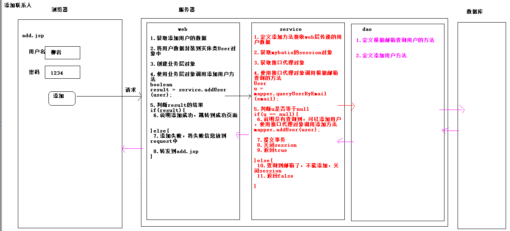

### 8.2代码实现

#### 1.dao层

~~~java
package com.itheima.sh.dao;

import com.itheima.sh.pojo.User;
import org.apache.ibatis.annotations.Insert;
import org.apache.ibatis.annotations.Param;
import org.apache.ibatis.annotations.Select;

import java.util.List;

public interface UserMapper {
    //1.查询所有用户的方法
    @Select("select * from t_user")
    List<User> queryAllUsers();

    //1.定义根据邮箱查询用户的方法
    @Select("select * from t_user where email=#{email}")
    User queryUserByEmail(@Param("email") String email);

    //2.定义添加用户方法
    @Insert("insert into t_user values(null,#{name},#{sex},#{age},#{address},#{qq},#{email})")
    void addUser(User user);
}

~~~

小结：

1.

~~~java
 // email=#{email} 等号左边书写的email是看数据表的字段名  大括号中的email是看@Param("email")注解中的内容，如果没有@Param("email")注解，大括号中随便书写
@Select("select * from t_user where email=#{email}")
 User queryUserByEmail(@Param("email") String email);
~~~

2.

~~~java
//如果方法参数是pojo实体类类型，大括号中书写的内容看实体类的成员变量，实际上是getXxxx，将get去掉，大写字母变为小写 
@Insert("insert into t_user values(null,#{name},#{sex},#{age},#{address},#{qq},#{email})")
    void addUser(User user);
~~~

#### 2.service层

~~~java
//1.定义添加方法接收web层传递的用户数据
    public boolean addUser(User user) {
        //2.获取mybatis的session对象
        SqlSession session = SessionFactoryUtils.getSession();

        //3.获取接口代理对象
        UserMapper mapper = session.getMapper(UserMapper.class);

        //4.使用接口代理对象调用根据邮箱查询的方法
        //从user实体类的对象获取邮箱
        String email = user.getEmail();
        User u = mapper.queryUserByEmail(email);

        //5.判断u是否等于null
        if (u == null) {
            //6.说明没有查询到，可以添加用户，使用接口代理对象调用添加方法
            mapper.addUser(user);

            //7.提交事务
            session.commit();
            //8.关闭session
            session.close();
            //9.返回true
            return true;

        } else {
            //10.查询到邮箱了，不能添加，关闭session
            session.close();
            //11.返回false
            return false;
        }
    }
~~~

小结：

根据邮箱先去数据库查询用户是否存在，如果存在则不要添加，如果不存在在添加。

#### 3.web层

~~~java
package com.itheima.sh.web;

import com.itheima.sh.pojo.User;
import com.itheima.sh.service.UserService;
import org.apache.commons.beanutils.BeanUtils;

import javax.servlet.ServletException;
import javax.servlet.annotation.WebServlet;
import javax.servlet.http.HttpServlet;
import javax.servlet.http.HttpServletRequest;
import javax.servlet.http.HttpServletResponse;
import java.io.IOException;
import java.lang.reflect.InvocationTargetException;
import java.util.Map;

@WebServlet("/addUser")
public class AddUserServlet extends HttpServlet {
    protected void doPost(HttpServletRequest request, HttpServletResponse response) throws ServletException, IOException {
        doGet(request, response);
    }

    protected void doGet(HttpServletRequest request, HttpServletResponse response) throws ServletException, IOException {
        //1.获取添加用户的数据
        Map<String, String[]> map = request.getParameterMap();

        //2.将用户数据封装到实体类User对象中
        User user = new User();
        try {
            /*
                如果使用BeanUtils封装页面的数据到实体类中，要求页面表单的name属性值必须和实体类的成员变量名一致(setXxxx()方法set去掉，大写变小写)
             */
            BeanUtils.populate(user, map);
            //3.创建业务层对象
            UserService service = new UserService();

            //4.使用业务层对象调用添加用户方法
            boolean result = service.addUser(user);

            //5.判断result的结果
            if (result) {
                //6.说明添加成功，跳转到成功页面
                response.sendRedirect("/add_ok.jsp");

            } else {
                //7.添加失败，将失败信息放到request中
                request.setAttribute("msg", "邮箱已经存在");

                //8.转发到add.jsp
                request.getRequestDispatcher("/add.jsp").forward(request, response);
            }
        } catch (Exception e) {
            e.printStackTrace();
        }

    }
}

~~~

小结：

 如果使用BeanUtils封装页面的数据到实体类中，要求页面表单的name属性值必须和实体类的成员变量名一致(setXxxx()方法set去掉，大写变小写)

#### 4.add.jsp页面

~~~jsp
<%@ page contentType="text/html;charset=UTF-8" language="java" %>
<!-- HTML5文档-->
<!DOCTYPE html>
<!-- 网页使用的语言 -->
<html lang="zh-CN">
<head>
    <!-- 指定字符集 -->
    <meta charset="utf-8">
    <!-- 使用Edge最新的浏览器的渲染方式 -->
    <meta http-equiv="X-UA-Compatible" content="IE=edge">
    <!-- viewport视口：网页可以根据设置的宽度自动进行适配，在浏览器的内部虚拟一个容器，容器的宽度与设备的宽度相同。
    width: 默认宽度与设备的宽度相同
    initial-scale: 初始的缩放比，为1:1 -->
    <meta name="viewport" content="width=device-width, initial-scale=1">
    <!-- 上述3个meta标签*必须*放在最前面，任何其他内容都*必须*跟随其后！ -->
    <title>添加用户</title>

    <!-- 1. 导入CSS的全局样式 -->
    <link href="css/bootstrap.min.css" rel="stylesheet">
    <!-- 2. jQuery导入，建议使用1.9以上的版本 -->
    
    <!-- 3. 导入bootstrap的js文件 -->
    
</head>
<body>

    
<h3>添加联系人页面</h3>

	
${requestScope.msg}

    <form action="/addUser" method="post" class="form-horizontal">
        

            <label class="col-lg-2 control-label" for="name">姓名：</label>
           

               <input type="text" class="form-control" id="name" name="name" placeholder="请输入姓名">
           

            <label class="col-lg-2 control-label" id="nameMsg"></label>
        

        

            <label class="col-lg-2 control-label">性别：</label>
            

                <input type="radio" name="sex" value="男" checked="checked"/>男
            

            

                <input type="radio" name="sex" value="女"/>女
            

            <label class="col-lg-2 control-label" id="sexMsg"></label>
        

        

            <label for="age" class="control-label col-lg-2">年龄：</label>
            

                <input type="text" class="form-control" id="age" name="age" placeholder="请输入年龄">
            

        

        

            <label for="jiguan" class="col-lg-2 control-label">籍贯：</label>
            

                <select name="address" class="form-control" id="jiguan">
                    <option value="广东">广东</option>
                    <option value="广西">广西</option>
                    <option value="湖南">湖南</option>
                </select>
            

        

        

            <label for="qq" class="control-label col-lg-2">QQ：</label>
           

               <input type="text" class="form-control" id="qq"  name="qq" placeholder="请输入QQ号码"/>
           

        

        

            <label for="email" class="col-lg-2 control-label">Email：</label>
           

               <input type="text" class="form-control" id="email" name="email" placeholder="请输入邮箱地址"/>
           

        

        

            <input class="btn btn-primary" type="submit" value="提交" />
            <input class="btn btn-default" type="reset" value="重置" />
            <input class="btn btn-default" type="button" value="返回" />
        

    </form>

</body>
</html>
~~~

#### 5.编写一个封装页面数据到实体类对象中的一个工具类

~~~java
package com.itheima.sh.utils;

import com.itheima.sh.pojo.User;
import org.apache.commons.beanutils.BeanUtils;

import javax.servlet.http.HttpServletRequest;
import java.lang.reflect.InvocationTargetException;
import java.util.Map;

/*
    编写一个封装页面数据到实体类对象中的一个工具类
    工具类特点：
    1.位于util包
    2.类中的方法是静态的
    3.私有化构造方法
 */
public class CommonBeanUtils {
    //3.私有化构造方法
    private CommonBeanUtils() {
    }

    // 2.类中的方法是静态的
    /*
        自定义泛型分类：
            1）接口
            2）类
            3）方法

       说明：
       1.static <T> T ： <T>表示定义泛型   T  当前方法的返回值类型
       2.Class<T> clazz  表示使用泛型T 即调用方法传入的类型

     */
    //Class<T> clazz = User.class
    public static <T> T beanPopulate(HttpServletRequest request, Class<T> clazz) {
        //1.获取页面提交的数据
        Map<String, String[]> map = request.getParameterMap();
        T obj = null;
        try {
            //2.使用BeanUtils工具类封装页面的数据到传递的实体类对象中
            //使用clazz创建传递实体类即User类对象
            //obj就是User类的对象  User user = new User();
            obj = clazz.newInstance();
            BeanUtils.populate(obj, map);
        } catch (Exception e) {
            e.printStackTrace();
        }

        //返回对象obj
        return obj;

    }
}

~~~

## 9.删除联系人

### 1.删除分类

分为两类：

​	1）物理删除：就是执行delete语句直接将数据从数据表中删除

​	2）逻辑删除：不是真正的删除，执行的是update语句，数据还在数据库中，但是用户查看不到了。

### 2.删除联系人的流程分析

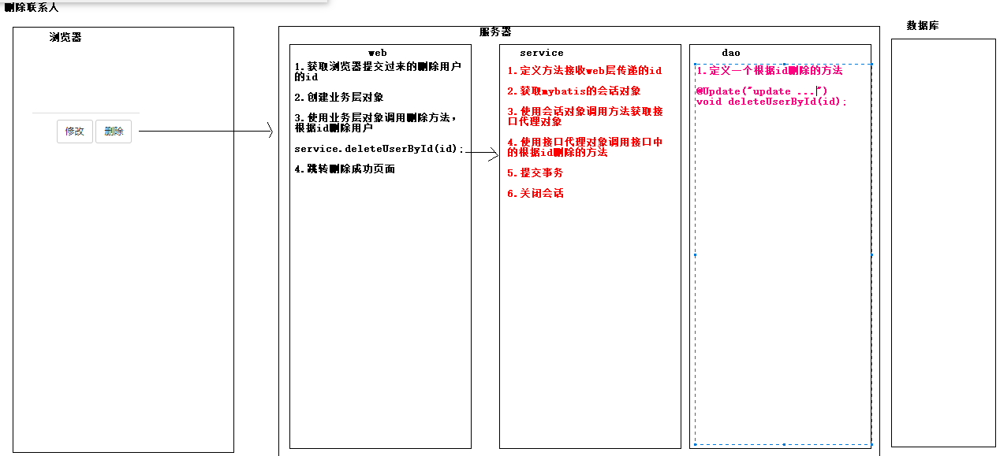

### 3.删除联系人准备工作

【1】我们使用的是逻辑删除，数据还在数据表中，只是让用户查看的时候看不到。这里我们执行的是update语句，我们可以给数据表增加一个字段来决定该用户是否已经删除。例如加一个isdelete字段，规定：0  未删除 ，1 已经删除。

如果我们相对某个用户进行逻辑删除，直接更改isdelete字段值为1.

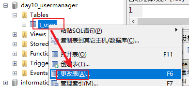

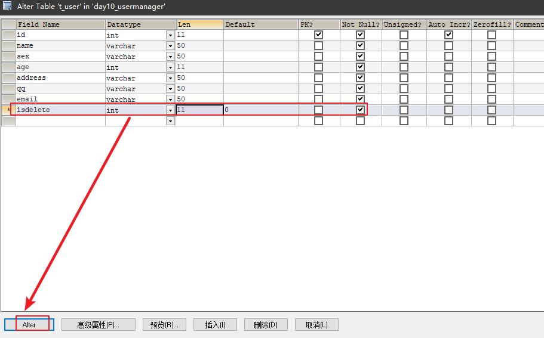

【2】给User实体类增加isdelete成员变量

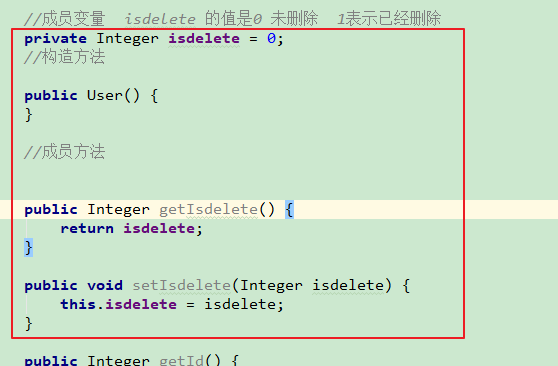

### 4.代码实现

#### 1.dao层

~~~java
//1.定义一个根据id删除的方法

@Update("update t_user set isdelete=1 where id=#{id}")
void deleteUserById(@Param("id") Integer id);
~~~

#### 2.service层

~~~java
 //1.定义方法接收web层传递的id
    public void deleteUserById(Integer id) {
        //2.获取mybatis的会话对象
        SqlSession session = SessionFactoryUtils.getSession();

        //3.获取接口代理对象
        UserMapper mapper = session.getMapper(UserMapper.class);

        //4. 使用接口代理对象调用接口中的根据id删除的方法
        mapper.deleteUserById(id);

        //5. 提交事务
        session.commit();

        //6. 关闭会话
        session.close();
    }
~~~

#### 3.web层

~~~java
package com.itheima.sh.web;

import com.itheima.sh.service.UserService;

import javax.servlet.ServletException;
import javax.servlet.annotation.WebServlet;
import javax.servlet.http.HttpServlet;
import javax.servlet.http.HttpServletRequest;
import javax.servlet.http.HttpServletResponse;
import java.io.IOException;

@WebServlet("/deleteUserById")
public class DeleteUserByIdServlet extends HttpServlet {
    protected void doPost(HttpServletRequest request, HttpServletResponse response) throws ServletException, IOException {
        doGet(request, response);
    }

    protected void doGet(HttpServletRequest request, HttpServletResponse response) throws ServletException, IOException {

        //1.获取浏览器提交过来的删除用户的id
        String uid = request.getParameter("uid");
        //转换为整数
        int id = Integer.parseInt(uid);
        //2.创建业务层对象
        UserService service = new UserService();

        //3.使用业务层对象调用删除方法，根据id删除用户
        service.deleteUserById(id);

        //4.跳转删除成功页面
        response.sendRedirect("/delete_ok.jsp");
    }
}

~~~

注意：

从前端页面获取的删除用户的id属于字符串，需要转换为整数在传递给service层。

#### 4.list.jsp页面

~~~jsp
<%@ taglib prefix="c" uri="http://java.sun.com/jsp/jstl/core" %>
<%@ page contentType="text/html;charset=UTF-8" language="java" %>
<!DOCTYPE html>
<!-- 网页使用的语言 -->
<html lang="zh-CN">
<head>
    <!-- 指定字符集 -->
    <meta charset="utf-8">
    <!-- 使用Edge最新的浏览器的渲染方式 -->
    <meta http-equiv="X-UA-Compatible" content="IE=edge">
    <!-- viewport视口：网页可以根据设置的宽度自动进行适配，在浏览器的内部虚拟一个容器，容器的宽度与设备的宽度相同。
    width: 默认宽度与设备的宽度相同
    initial-scale: 初始的缩放比，为1:1 -->
    <meta name="viewport" content="width=device-width, initial-scale=1">
    <!-- 上述3个meta标签*必须*放在最前面，任何其他内容都*必须*跟随其后！ -->
    <title>用户信息管理系统</title>

    <!-- 1. 导入CSS的全局样式 -->
    <link href="css/bootstrap.min.css" rel="stylesheet">
    <!-- 2. jQuery导入，建议使用1.9以上的版本 -->
    
    <!-- 3. 导入bootstrap的js文件 -->
    
    
</head>
<body>

    <h3 style="text-align: center">用户信息列表</h3>
    <table border="1" class="table table-bordered table-hover">
        <tr class="success">
            <th>编号</th>
            <th>姓名</th>
            <th>性别</th>
            <th>年龄</th>
            <th>籍贯</th>
            <th>QQ</th>
            <th>邮箱</th>
            <th>操作</th>
        </tr>
        <%--使用JSTL+EL取出request域对象中的数据--%>
        <c:forEach items="${requestScope.list}" var="user">
            <tr>
                <td>${user.id}</td>
                <td>${user.name}</td>
                <td>${user.sex}</td>
                <td>${user.age}</td>
                <td>${user.address}</td>
                <td>${user.qq}</td>
                <td>${user.email}</td>
                <td><a class="btn btn-default btn-sm" href="update.jsp">修改
                    <%--
                        onclick="deleteUserById(${user.id});" 给a标签绑定单击事件，执行deleteUserById函数，然后当前用户的id作为函数参数传递
                    --%>
                </a>&nbsp;<a class="btn btn-default btn-sm" href="javascript:" onclick="deleteUserById(${user.id});">删除</a></td>
            </tr>
        </c:forEach>

        <tr>
            <td colspan="8" align="center"><a class="btn btn-primary" href="add.jsp">添加联系人</a></td>
        </tr>
    </table>

</body>
</html>

~~~

小结：

1.给删除安妮绑定单击事件，然后调用js函数，在js函数体中弹出确认框

2.在js函数中向后台发送删除用户的id

#### 5.删除之后的注意事项

【1】查询

我们这里使用逻辑删除，删除之后isdelete变为1.那么在查询的时候不应该在查询到。

修改查询的sql语句：

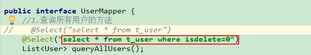

【2】添加

插入用户的时候由于数据表中多了一个字段isdelete，此时添加会报错。

修改UserMapper的添加方法上面的添加语句。多插入一个字段值是0，isdelete默认值是0.

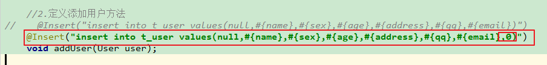

## 10.修改联系人

修改联系人说明：

修改有两个流程：

1.数据的回显

2.修改数据

### 1.数据的回显

就是在list.jsp页面中点击修改按钮立刻将当前用户的id传递到后台，后台接收到当前用户的id.根据获取的用户id查询当前用户信息。显示到update.jsp即修改页面。

#### 1.1数据回显的流程

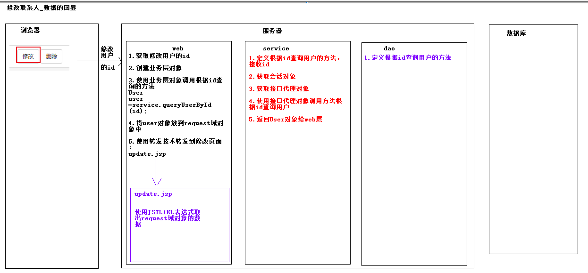

#### 1.2代码实现

##### 1.dao层

~~~java
//1.定义根据id查询用户的方法
@Select("select * from t_user where id=#{id}")
User queryUserById(@Param("id") Integer id);
~~~

##### 2.service层

~~~java
//1.定义根据id查询用户的方法，接收id
    public User queryUserById(Integer id) {
        //2.获取mybatis的会话对象
        SqlSession session = SessionFactoryUtils.getSession();

        //3.获取接口代理对象
        UserMapper mapper = session.getMapper(UserMapper.class);

        //4. 使用接口代理对象调用方法根据id查询用户
        User user = mapper.queryUserById(id);

        //5. 返回User对象给web层
        return user;
    }
~~~

##### 3.web层

~~~java
package com.itheima.sh.web;

import com.itheima.sh.pojo.User;
import com.itheima.sh.service.UserService;

import javax.servlet.ServletException;
import javax.servlet.annotation.WebServlet;
import javax.servlet.http.HttpServlet;
import javax.servlet.http.HttpServletRequest;
import javax.servlet.http.HttpServletResponse;
import java.io.IOException;

@WebServlet("/queryUserById")
public class QueryUserByIdServlet extends HttpServlet {
    protected void doPost(HttpServletRequest request, HttpServletResponse response) throws ServletException, IOException {
        doGet(request, response);
    }

    protected void doGet(HttpServletRequest request, HttpServletResponse response) throws ServletException, IOException {
        //1.获取修改用户的id
        String uid = request.getParameter("uid");
        int id = Integer.parseInt(uid);
        //2.创建业务层对象
        UserService service = new UserService();
        //3.使用业务层对象调用根据id查询的方法
        User user =service.queryUserById(id);

        //4.将user对象放到request域对象中
        request.setAttribute("user",user);
        //5.使用转发技术转发到修改页面：update.jsp
        request.getRequestDispatcher("/update.jsp").forward(request,response);
        
    }
}

~~~

##### 4.list.jsp

在list.jsp页面中点击修改按钮，将修改用户的id传递到根据id查询的servlet中。

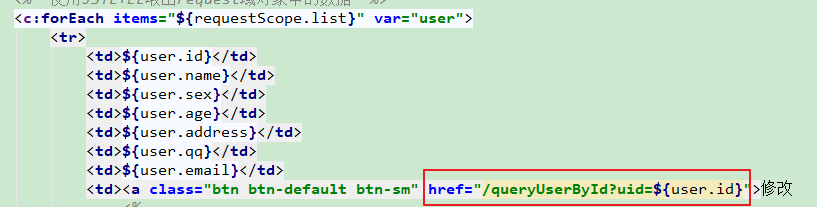

##### 5.update.jsp

~~~jsp
<%@ page language="java" import="java.util.*" pageEncoding="UTF-8"%>
<%@ taglib uri="http://java.sun.com/jsp/jstl/core" prefix="c" %>
<%
String path = request.getContextPath();
String basePath = request.getScheme()+"://"+request.getServerName()+":"+request.getServerPort()+path+"/";
%>
<!DOCTYPE html>
<!-- 网页使用的语言 -->
<html lang="zh-CN">
    <head>
    	<base href="<%=basePath%>"/>
        <!-- 指定字符集 -->
        <meta charset="utf-8">
        <meta http-equiv="X-UA-Compatible" content="IE=edge">
        <meta name="viewport" content="width=device-width, initial-scale=1">
        <title>修改用户</title>

        <link href="css/bootstrap.min.css" rel="stylesheet">
        
        
        
    </head>
    <body>
        

        <h3 style="text-align: center;">修改联系人</h3>
        <form action="" method="post">
          

            <label for="name">姓名：</label>
            <input type="text" class="form-control" id="name" name="name" placeholder="请输入姓名" value="${requestScope.user.name}"/>
          

          

            <label>性别：</label>
              <%--
                    ${requestScope.user.sex='男'}：
                        1.requestScope.user 表示从request域对象中获取user对象
                        2.requestScope.user.sex 表示使用获取的user对象调用User实体类中的getSex方法获取性别的值
              --%>
              <input type="radio" name="sex" value="男"
                  <c:if test="${requestScope.user.sex=='男'}">
                      checked="checked"
                  </c:if>
              />男
                <input type="radio" name="sex" value="女"
                    <c:if test="${requestScope.user.sex=='女'}">
                        checked="checked"
                    </c:if>
                />女
          

          

            <label for="age">年龄：</label>
            <input type="text" class="form-control" id="age"  name="age" placeholder="请输入年龄" value="${requestScope.user.age}"/>
          

          

            <label for="address">籍贯：</label>
             <select name="address" class="form-control" >
                <option value="广东"
                    <c:if test="${requestScope.user.address == '广东'}">
                        selected="selected"
                    </c:if>
                >广东</option>
                <option value="广西"
                    <c:if test="${requestScope.user.address == '广西'}">
                        selected="selected"
                    </c:if>
                >广西</option>
                <option value="湖南"
                    <c:if test="${requestScope.user.address == '湖南'}">
                        selected="selected"
                    </c:if>
                >湖南</option>
            </select>
          

          

            <label for="qq">QQ：</label>
            <input type="text" readonly="readonly" class="form-control" name="qq" placeholder="请输入QQ号码" value="${requestScope.user.qq}"/>
          

          

            <label for="email">Email：</label>
            <input type="text" readonly="readonly" class="form-control" name="email" placeholder="请输入邮箱地址" value="${requestScope.user.email}"/>
          

             

                <input class="btn btn-primary" type="submit" value="提交" />
                <input class="btn btn-default" type="reset" value="重置" />
                <input class="btn btn-default" type="button" value="返回"/>
             

        </form>
        

    </body>
</html>
~~~

##### 6.效果：

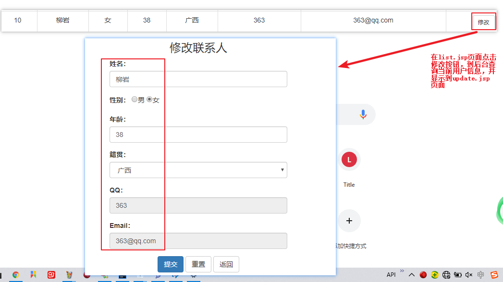

### 2.修改数据

#### 2.1流程分析

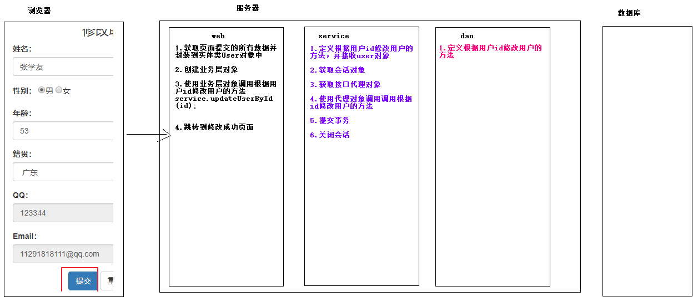

~~~markdown
# web:
1.获取页面提交的所有数据并封装到实体类User对象中
2.创建业务层对象
3.使用业务层对象调用根据用户id修改用户的方法
service.updateUserById(id);
4.跳转到修改成功页面

# service
1.定义根据用户id修改用户的方法，并接收user对象
2.获取会话对象
3.获取接口代理对象
4.使用代理对象调用调用根据id修改用户的方法
5.提交事务
6.关闭会话

# dao
1.定义根据用户id修改用户的方法
~~~

#### 2.2代码实现

##### 1.dao层

~~~java
//1.定义根据用户id修改用户的方法
    @Update("update t_user set name=#{name},sex=#{sex},age=#{age},address=#{address} where id=#{id}")
    void updateUserById(User user);
~~~

##### 2.service层

~~~java
 //1.定义根据用户id修改用户的方法，并接收user对象
    public void updateUserById(User user){
        //2.获取mybatis的会话对象
        SqlSession session = SessionFactoryUtils.getSession();

        //3.获取接口代理对象
        UserMapper mapper = session.getMapper(UserMapper.class);
        //4.使用代理对象调用调用根据id修改用户的方法
        mapper.updateUserById(user);
        //5.提交事务
        session.commit();
        //6.关闭会话
        session.close();
    }
~~~

##### 3.web层

~~~java
package com.itheima.sh.web;

import com.itheima.sh.pojo.User;
import com.itheima.sh.service.UserService;
import com.itheima.sh.utils.CommonBeanUtils;

import javax.servlet.ServletException;
import javax.servlet.annotation.WebServlet;
import javax.servlet.http.HttpServlet;
import javax.servlet.http.HttpServletRequest;
import javax.servlet.http.HttpServletResponse;
import java.io.IOException;

@WebServlet("/updateUserById")
public class UpdateUserByIdServlet extends HttpServlet {
    protected void doPost(HttpServletRequest request, HttpServletResponse response) throws ServletException, IOException {
        doGet(request, response);
    }

    protected void doGet(HttpServletRequest request, HttpServletResponse response) throws ServletException, IOException {
        //1.获取页面提交的所有数据并封装到实体类User对象中
        User user = CommonBeanUtils.beanPopulate(request, User.class);
        //2.创建业务层对象
        UserService service = new UserService();
        //3.使用业务层对象调用根据用户id修改用户的方法
        service.updateUserById(user);
        //4.跳转到修改成功页面
        response.sendRedirect("/update_ok.jsp");
    }
}

~~~

##### 4.update.jsp

~~~jsp
<%@ page language="java" import="java.util.*" pageEncoding="UTF-8"%>
<%@ taglib uri="http://java.sun.com/jsp/jstl/core" prefix="c" %>
<%
String path = request.getContextPath();
String basePath = request.getScheme()+"://"+request.getServerName()+":"+request.getServerPort()+path+"/";
%>
<!DOCTYPE html>
<!-- 网页使用的语言 -->
<html lang="zh-CN">
    <head>
    	<base href="<%=basePath%>"/>
        <!-- 指定字符集 -->
        <meta charset="utf-8">
        <meta http-equiv="X-UA-Compatible" content="IE=edge">
        <meta name="viewport" content="width=device-width, initial-scale=1">
        <title>修改用户</title>

        <link href="css/bootstrap.min.css" rel="stylesheet">
        
        
        
    </head>
    <body>
        

        <h3 style="text-align: center;">修改联系人</h3>
        <form action="/updateUserById" method="post">
            <%--将当前要修改的id传递给servlet--%>
            <input type="hidden" name="id" value="${requestScope.user.id}"/>

          

            <label for="name">姓名：</label>
            <input type="text" class="form-control" id="name" name="name" placeholder="请输入姓名" value="${requestScope.user.name}"/>
          

          

            <label>性别：</label>
              <%--
                    ${requestScope.user.sex='男'}：
                        1.requestScope.user 表示从request域对象中获取user对象
                        2.requestScope.user.sex 表示使用获取的user对象调用User实体类中的getSex方法获取性别的值
              --%>
              <input type="radio" name="sex" value="男"
                  <c:if test="${requestScope.user.sex=='男'}">
                      checked="checked"
                  </c:if>
              />男
                <input type="radio" name="sex" value="女"
                    <c:if test="${requestScope.user.sex=='女'}">
                        checked="checked"
                    </c:if>
                />女
          

          

            <label for="age">年龄：</label>
            <input type="text" class="form-control" id="age"  name="age" placeholder="请输入年龄" value="${requestScope.user.age}"/>
          

          

            <label for="address">籍贯：</label>
             <select name="address" class="form-control" >
                <option value="广东"
                    <c:if test="${requestScope.user.address == '广东'}">
                        selected="selected"
                    </c:if>
                >广东</option>
                <option value="广西"
                    <c:if test="${requestScope.user.address == '广西'}">
                        selected="selected"
                    </c:if>
                >广西</option>
                <option value="湖南"
                    <c:if test="${requestScope.user.address == '湖南'}">
                        selected="selected"
                    </c:if>
                >湖南</option>
            </select>
          

          

            <label for="qq">QQ：</label>
            <input type="text" readonly="readonly" class="form-control" name="qq" placeholder="请输入QQ号码" value="${requestScope.user.qq}"/>
          

          

            <label for="email">Email：</label>
            <input type="text" readonly="readonly" class="form-control" name="email" placeholder="请输入邮箱地址" value="${requestScope.user.email}"/>
          

             

                <input class="btn btn-primary" type="submit" value="提交" />
                <input class="btn btn-default" type="reset" value="重置" />
                <input class="btn btn-default" type="button" value="返回"/>
             

        </form>
        

    </body>
</html>
~~~

小结：

别忘记提交修改数据的时候提交用户的id.页面不需要显示，后台还需要获取，此时使用隐藏域即可。

~~~jsp
<%--将当前要修改的id传递给servlet--%>
<input type="hidden" name="id" value="${requestScope.user.id}"/>
~~~

