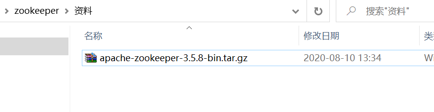
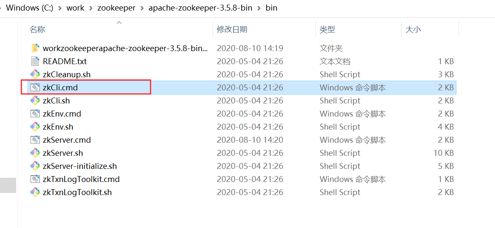
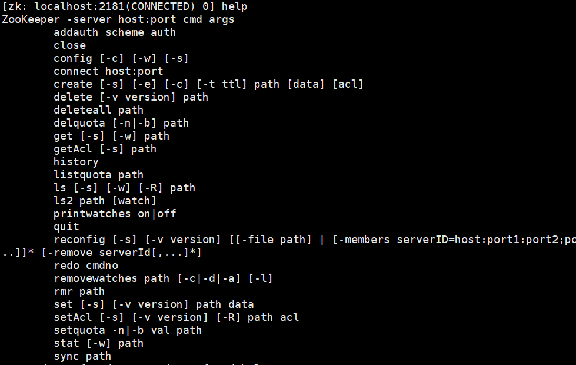

# Apache ZooKeeper  

## 学习目标  

1、了解软件架构的演进过程

2、掌握zookeeper的安装

3、了解zookeeper的数据单元

3、掌握znode节点类型

4、掌握zookeeper常用命令

5、掌握zkclient操作zookeeper节点增删改查

6、了解zookeeper节点Watch监听

## 1、软件架构演进

软件架构的发展经历了由单体架构、垂直架构、SOA架构到微服务架构的演进过程，下面我们分别了解一下这几个架构。  

软件架构演进概览：


### 1.1单体架构

 

特点：  all  in  one

```
①所有功能集中在一个项目中

②所有功能都要打成war包部署到服务器

③ 通过集群(session共享集群,如使用redis缓存存储session数据)来提高服务器的性能
```

例如我们在javaweb学习的**黑马旅游项目 就是单体架构！**

优点:
    ①.项目架构简单,前期开发的成本低,周期短,小型企业首选.

缺点:
    全部的功能都集中在一个项目中完成,对于大型项目来说,开发难度高,不容易开发及扩展和维护

具体缺点如下：

1.复杂性高 **整个项目包含的模块非常多，模块的边界模糊，依赖关系不清晰**，代码质量参差不齐,整个项目非常复杂。每次修改代码都心惊胆战，甚至添加一个简单的功能，或者修改一个BUG都会造成隐含的缺陷。

2.技术债务逐渐上升 随着时间推移、需求变更和人员更迭，会逐渐形成应用程序的技术债务，并且越积越多。已使用的系统设计或代码难以修改，因为应用程序的其他模块可能会以意料之外的方式使用它。

3.部署速度逐渐变慢 随着代码的增加，构建和部署的时间也会增加。而在单体应用中，**每次功能的变更或缺陷的修复都会导致我们需要重新部署整个应用。**全量部署的方式耗时长、影响范围大、风险高，这使得单体应用项目上线部署的频率较低，从而又导致两次发布之间会有大量功能变更和缺陷修复，出错概率较高。

4.扩展能力受限，无法按需伸缩 **单体应用只能作为一个整体进行扩展**，无法结合业务模块的特点进行伸缩。

5.阻碍技术创新 单体应用往往使用统一的技术平台或方案解决所有问题，**团队的每个成员都必须使用相同的开发语言和架构，想要引入新的框架或技术平台非常困难**。由于单体架构的缺陷日益明显，所以越来越多的公司采用微服务架构解决上面提到的单体架构中的问题。不同于构建单一、庞大的应用，微服务架构将应用拆分为一套小且互相关联的服务


### 1.2垂直架构

电商系统为例


架构说明：       

​      按照**业务进行切割**，形成小的单体项目。

```markdown
特点:
    ①.以单体架构为单位进行系统的划分,划分成一个个系统.
    ②.项目与项目之间独立开发，开发效率高.
    ③.项目是以接口调用为主(早期主要使用webservice)
优点:
    ①.项目架构简单,前期开发的成本低,周期短,小型企业首选.
    ②.垂直架构进行mvc分层设计,针对分层做相应的处理做到集群(10~1000)
    ③.不同的项目采用不同的技术实现.
    
缺点:
    ①.全部的功能都集中在一个项目中完成,对于大型项目来说,开发难度高,不容易开发及扩展和维护.
    ②.集群扩展有瓶颈
    ②.项目与项目之间存在数据冗余,耦合度高.
    ②.项目是以接口调用为主,存在数据同步问题.
```

### 1.3SOA架构

SOA全称为Service-Oriented Architecture，即**面向服务的架构**。

它可以根据需求通过网络对松散耦合的粗粒度应用组件(服务)进行分布式部署、组合和使用。

**一个服务通常以独立的形式存在于操作系统进程中。**

站在功能的角度，把**业务逻辑抽象成可复用的服务**，通过服务的编排实现业务的快速再生，

目的：把原先固有的业务功能转变为通用的业务服务，实现业务逻辑的快速复用。


架构说明：

​      将重复功能或模块抽取成组件的形式，对外提供服务，在项目与服务之间使用ESB（企业服务总线）的形式作为通信的桥梁。

特点:
    ①.基于soa服务思想进行功能的抽取(重复代码问题解决),以**服务为中心来管理项目**.
    ②.各个系统之间要进行调用,所以出现ESB来管理项目(可以使用各种技术实现:webservice,rpc等)
    ③.ESB是作为系统与系统之间连接的桥梁,进行统一管理.

优点:
    ①.重复代码进行了抽取,提高了开发效率,提高了系统的可维护性.
    ②.可以针对某个系统进行扩展,做集群更容易.
    ③.采用ESB来管理服务组件,有利于降低企业开发项目难度 

缺点:
    ①.系统与服务的界限模糊的,不利于设计.
    ②.ESB是作为系统与系统之间桥梁,没有统一标准,种类很多,不利于维护！


常见的企业服务总线：

1. IBM WebSphere ESB
2. Microsoft ESB
3. JBOSS SOA Platform等等

### 1.4微服务架构


架构说明：

- 将系统服务层完全独立出来，抽取为一个一个的微服务。

- 抽取的粒度更细，遵循单一原则。

- 采用轻量级框架协议传输。

特点:

```markdown
	①.把系统的服务层完全独立出来,有利于资源的重复利用,提高开发效率.
    ②.微服务遵守单一原则
    ③.微服务与微服务之间的调用使用restful轻量级调用.
```

优点:

```markdown
    ①.微服务拆分更细,有利于资源的重复利用,提高开发效率
    ②.可以更加精准针对某个服务做方案
    ③.微服务去中心化,使用restful轻量级通信协议比使用ESB企业服务总线更容易维护
    ④.适应市场更容易,产品迭代周期更短.
```

缺点:

```markdown
	微服务量多,服务治理成本高,不利于系统维护
    分布式系统架构且是微服务架构,技术成本高(容错,分布式事务等),对团队高挑战
```

### 1.5Serverless架构


​	为了减少运维，降低部署难度。现在越来越多的大厂在开始布局云计算战场了，目前微服务架构开发Serverless模式的有腾讯的tsf:https://cloud.tencent.com/product/tsf

### 1.6阿里淘宝架构演进之路

参考文献：https://mp.weixin.qq.com/s?__biz=MzU0OTk3ODQ3Ng==&mid=2247485427&idx=1&sn=35a1d4d4bc8a96ecb5e841bea2cc1102&chksm=fba6eff0ccd166e6c048741bec01d8979b2be277f6abd38996e0aed2e2f887559dd61f693c71&mpshare=1&scene=1&srcid=0616Hpu6jcYpt7HaXeXHDhea&sharer_sharetime=1596984524454&sharer_shareid=5e222757dd91db135a3736679bc9eb56&key=bbd9db2a3d7572cdbd226e0775c7ca7f0d70f724d8b03095eeecf112cc204c20fba4dff140e40327c794c36ff38352fba5da804015bb2ed758cfdec881b8600fc88cd85cc84fe8b87c901e1b1da583fb&ascene=1&uin=MTE5ODAyNDI3OA%3D%3D&devicetype=Windows+10+x64&version=62090529&lang=zh_CN&exportkey=A1PI8LOUY6TMNRWrt7504jQ%3D&pass_ticket=U40ThnXGAl1WXUCF7y5mEpLjz19dLmkCkdYPHIB2MTvojIlJr2M57ToBVxtUzROh

## 2.服务注册中心介绍

问题：

**那么一旦采用分布式架构，服务都部署在不同的机器上，如何实现服务的通信呢？**

**服务和服务之间如何进行调用的？**

要解决上面的问题，我们就需要使用**服务中心**（解决服务注册地址）+**rpc通信**（解决数据传输通信问题）

(我们今天讲的zookeeper可以实现服务注册中心)。

解决： 采用服务中心，服务中心可以发现服务，进行服务治理。

**没有服务中心，服务之间调用**


**使用服务注册中心管理服务**


## 3.zookeeper概述

### 3.1 zookeeper简介

官网地址:https://zookeeper.apache.org/

**动物园管理员**

ZooKeeper是一个分布式的，开放源码的分布式应用程序协调服务，是Google的Chubby一个开源的实现，是Hadoop和Hbase的重要组件。它是一个为分布式应用提供一致性服务的软件，提供的功能包括：配置维护、域名服务、分布式同步、组服务等。其由JAVA编写，支持JAVA 和C两种语言的客户端。

 

### 3.2Zookeeper常见的应用场景

1.服务注册中心

2.分布式锁

### 3.3 zookeeper数据存储单元znode

zookeeper中数据基本单元叫节点，即为znode。一个znode节点下面又可以包含多个子节点，最终以树的这种层级结构呈现出来。每个znode节点路径path唯一，存储自己的节点数据。

我们可以通过文件系统目录结构大致对znode结构有个初步认识：


zookeeper的znode节点模型：


**所以zookeeper存储的数据节点 都是以/ 开头  以树状结构进行存储数据！**

**并且zookeeper对所在的节点和数据 自带监控功能，可以随时监听到数据节点和存储数据的变化。**

## 4.zookeeper下载安装

下载页面地址：https://zookeeper.apache.org/releases.html

我们这里下载3.5.8的版本，老师已经提前下载好了在资料里面的apache-zookeeper-3.5.8-bin.tar.gz文件。



#### linux环境下安装zookeeper(了解)

1：安装jdk（略）

2：把.gz文件上传到linux系统


3：解压缩文件

```
tar -zxvf apache-zookeeper-3.5.8-bin.tar.gz
```


4：文件夹重新命名

```
mv apache-zookeeper-3.5.8-bin /usr/local/zookeeper
```


5：进入zookeeper目录

```
cd /usr/local/zookeeper/
```

6：创建数据存放目录

```
mkdir data
```

7：进入conf目录

```
cd conf
```

8：将文件zoo_sample.cfg备案一份，文件名为zoo.cfg

```
cp zoo_sample.cfg zoo.cfg
```

9.修改zoo.cfg配置文件

```
vi zoo.cfg
```

修改dataDir属性为自己的目录地址：


配置说明：

```
# zookeeper时间配置中的基本单位 (毫秒)
tickTime=2000
# 允许follower初始化连接到leader最大时长，它表示tickTime时间倍数 即:initLimit*tickTime
initLimit=10
# 允许follower与leader数据同步最大时长,它表示tickTime时间倍数 
syncLimit=5
#zookeper 数据存储目录
dataDir=/tmp/zookeeper
#对客户端提供的端口号
clientPort=2181
#单个客户端与zookeeper最大并发连接数
#maxClientCnxns=60
# 保存的数据快照数量，之外的将会被清除
#autopurge.snapRetainCount=3
#自动触发清除任务时间间隔，小时为单位。默认为0，表示不自动清除。
#autopurge.purgeInterval=1
```

10.启动zookeeper服务端

先切换到zookeeper的bin目录

```
cd /usr/local/zookeeper/bin/
```

执行脚本：

```
./zkServer.sh start
```

 

以上就是zookeeper的安装以及启动过程。

接下来咋们用客户端连接一下：

同样在bin目录下执行：

```
./zkCli.sh
```

执行完如果出现WatchedEvent state:SyncConnected type:None path:null一直卡主住这里可以敲回车即可。

 

zookeeper默认创建了一个名称为"zookeeper"的znode节点。

11.服务停止

```
./zkServer.sh stop
```

#### windows环境下安装zookeeper（教学）

1.确保jdk环境变量配置正确

2.将apache-zookeeper-3.5.8-bin.tar.gz压缩文件进行解压

解压后目录结构：


3.在安装目录下新建一个data文件夹


4.进入conf文件夹并将zoo_samle.cfg文件备份一份重命名为zoo.cfg


5.编辑并修改zoo.cfg文件内容中dataDir目录地址


配置说明：

```
# zookeeper时间配置中的基本单位 (毫秒)
tickTime=2000
# 允许follower初始化连接到leader最大时长，它表示tickTime时间倍数 即:initLimit*tickTime
initLimit=10
# 允许follower与leader数据同步最大时长,它表示tickTime时间倍数 
syncLimit=5
#zookeper 数据存储目录
dataDir=/tmp/zookeeper
#对客户端提供的端口号
clientPort=2181
#单个客户端与zookeeper最大并发连接数
#maxClientCnxns=60
# 保存的数据快照数量，之外的将会被清除
#autopurge.snapRetainCount=3
#自动触发清除任务时间间隔，小时为单位。默认为0，表示不自动清除。
#autopurge.purgeInterval=1
```

6.启动zookeeper

找到bin目录下zkServer.cmd，双击运行，注意：此版本zookeeper启动会默认**占用8080端口**


<font color="red">**注意：1.如果你当前8080端口被占用了，那么启动的时候会闪退，cmd窗口会自动关闭，此时可以在zoo.cfg配置文件里面最后一行添加admin.serverPort=8123，然后再双击zkServer.cmd运行就ok了。2.dataDir路径配置的一定不要包含中文，并且路径使用'\\'不要使用'/'。**</font>


7.客户端访问

在bin目录下双击zkCli.cmd




## 5.zookeeper常用命令(了解)

对zookeeper存储的数据节点，我们可以通过代码实现，当然也可以采用命令方式操作节点！

常用的zookeeper节点命令： 

help查看提供的命令列表：



zk提供了很多命令给我们，接下来我们来学习一下zk的**常用命令**。

#### create

语法：create [-s] [-e] [-c] [-t ttl] path [data] [acl]

**创建节点：**

前面的课程我们讲到zk的基本单元是基于类似文件系统的path唯一路径存放的数据结构节点：znode。

znode分为四种类型：持久节点、持久序号节点、临时节点、临时序号节点。

##### *持久节点*：

持久化保存的节点，zk默认创建的节点类型就是持久节点，如：

```
#默认创建的就是持久节点,创建的节点名称以path路径形式创建
create /hello
```


ls /查看创建的节点

 

*<font color="red">注意:创建节点和linux创建文件夹目录相似，如果创建一个上级路径不存在的节点会报错误</font>*：

 

##### *持久序号节点*：

持久化保存的节点，同时创建的节点会以一串序号作为后缀,创建时添加-s参数：

```
create -s /hello-world
```

命令可以连续多敲几次，然后你 ls / 列出节点查看效果：


##### *临时节点*: 

不持久化保存，只存在于当前客户端保持连接期间。当客户端断开连接后会自动删除，创建时添加-e参数：

```
create -e /hello-world-e
```

打开两个终端:

1.创建临时节点


创建完成后，另外的客户端也可以查看到节点。

2.使用close命令关闭创建临时节点的会话


此时观察发现另外的客户端都不能查询之前创建的临时节点/hello-world-e了.

关闭会话的客户端输入connect重新连接，后续做监控测试有用。

##### 临时序号节点:

不持久化保存，只存在于当前客户端会话期间，同时创建的节点会以一串序号作为后缀，创建时添加-e -s参数：

```
create -e -s /hello-world-e-s
```


<font color="red">注意:临时节点不能创建子节点</font>

**节点类型小结:**

- zookeeper的znode节点默认创建的是持久节点。

- 临时节点的特征是只要创建该临时节点的客户端连接关闭了或者session超时连接，那么服务端会自动将该客户端所创建的所有临时节点全部删除。
- zookeeper还支持序号节点，创建节点的时候会根据节点的path作为前缀，序号进行递增。

#### ls

语法: ls  s] [-w] [-R] path

watch  观察 监听

与linux的ls差不多，列出子节点。-s 同时显示节点对应的状态，-w 监控某个节点，-R 递归列出所有子节点

##### 基本查询

path:节点路径


##### 递归查询


##### 节点监控  -w   watch  

只能监控子节点的创建、删除  **一次性**


ls -w /hello,监控/hello节点，当改节点路径下新创建了一个子节点后会立马感知到。

下面看一下连续创建子节点效果：


发现没有继续监控，监控的数据还是之前第一次的那一条。

注意：很多一线互联网公司喜欢问你zk的监控生效次数，这时候你应该回答监控只会有一次生效.

**新版本的3.6之后addWatch命令优化了这块的监控，也就是监控实现了自递归监听。**

#### addWatch(了解命令)

监控节点

基本语法：addWatch [-m mode] path

 


#### set

create命令创建了znode节点，此时还没给节点赋值。你也可以理解为文件夹创建好了，里面内容还是空的，通过set命令可以赋值操作：

基本语法：set [-s] [-v version] path data

-s设置完值后同时查看节点状态

-v设置值的同时带上版本号

```
set /hello 123
```

 

 

#### get

查看节点数据

基础语法：get [-s] [-w] path

-w **监控当前节点的数据变化**

-s 同时查看节点状态

开启节点数据监控：

```
get -w /hello
```


#### delete

删除节点：只能删除没有子节点的节点

基础语法：delete [-v version] path


#### deleteall

递归删除，会将当前节点以及所有子节点都删除

基本语法：deleteall path


#### stat

查看节点属性

基本语法：stat [-w] path

```
stat /helloacl
```

 

属性说明：  

```
cZxid = 0x24  #创建节点的事物ID
ctime = Mon Aug 10 16:45:17 CST 2020 #创建时间
mZxid = 0x26 #修改节点的事物ID
mtime = Mon Aug 10 16:46:39 CST 2020 #修改时间
pZxid = 0x24 #子节点变更的事物ID
cversion = 0 #这表示对此znode的子节点进行的更改次数（不包括子节点）
dataVersion = 1 # 数据版本，变更次数
aclVersion = 1 #权限版本，变更次数
ephemeralOwner = 0x0 #临时节点所属会话ID
dataLength = 3 #数据长度
numChildren = 0 #子节点数(不包括子子节点)
```

#### close

关闭当前客户端会话

基本语法：close

输入命令后会一直卡着，可以敲一下回车键回到客户端命令模式。


#### connect

连接命令，如close完了以后想重新建立连接可以输入此命令

基本语法：connect


<font color="red">记得敲回车键回到命令模式。</font>

#### quit

退出当前客户端

基本语法：quit


## 6.Java客户端操作Zookeeper(了解)

我们在前面的章节已经学习了怎么通过zookeeper自带的zkCli客户端来操作我们的zookeeper节点，那么我们怎么使用我们的java程序来操作我们的zookeeper呢。

### 6.1 创建节点

1.导入客户端maven依赖

有两种：

一种的官网自带的，api较为繁琐，只需要看懂即可！

另一种的基于官方的基础上做了一些封装和优化的处理. ZkClient

2.创建zookeeper连接对象

3.通过zookeeper对象发送命令

4.关闭连接

创建一个maven项目，项目名称为：zk-connection

在pom.xml文件中引入zookeeper的依赖：  

```xml
<dependencies>
	<dependency>
		<groupId>org.apache.zookeeper</groupId>
		<artifactId>zookeeper</artifactId>
		<version>3.5.8</version>
	</dependency>
</dependencies>
```

核心类： org.apache.zookeeper.**ZooKeeper**创建与服务端的连接，构造函数参数说明如下：

| 参数名称       | 类型         | 说明                                                         |
| :------------- | :----------- | :----------------------------------------------------------- |
| connectString  | String       | 连接串，包括ip+端口 ,集群模式下用逗号隔开  192.168.148.139:2181,192.168.148.140:2181 |
| sessionTimeout | **int **     | 会话超时时间，该值不能超过服务端所设置的  *minSessionTimeout 和maxSessionTimeout* |
| watcher        | Watcher      | 会话监听器，服务端事件将会触发该监听                         |
| sessionId      | **long **    | 自定义会话ID                                                 |
| sessionPasswd  | **byte**[]   | 会话密码                                                     |
| canBeReadOnly  | **boolean ** | 该连接是否为只读的                                           |
| hostProvider   | HostProvider | 服务端地址提供者，指示客户端如何选择某个服务来调用，默认采用StaticHostProvider实现 |

示例代码如下:

代码说明： **因为zookeeper创建链接采用的方式： 异步**  

所以我们在编写代码时，要注意一下，如果网络延迟，或者安装了虚拟网卡，则需要等待java客户端和zookeeper链接成功之后，再进行创建节点 ，否则会由于ip寻址,导致代码出错！

```java
     //1.zookeeper连接服务器
        ZooKeeper zooKeeper = new ZooKeeper("127.0.0.1:2181", 1000,
                new Watcher() {
                    public void process(WatchedEvent event) {
                        if(event.getState()==Event.KeeperState.SyncConnected){
                              //   链接成功    线程放行
                            System.out.println("=======创建链接完毕======"+event.getState());
                        }

                    }
                }
        );
        System.in.read();//  主线程阻塞 ：等待输入

说明：  System.in.read(); 是让当前线程阻塞， 等待if语句的执行，当if语句执行时，说明我们的java程序
和zookeeper链接成功 ，我们才可以向下执行代码
```

完整的代码：

```java
package cn.itcast.zookeeper;

import org.apache.zookeeper.*;

import java.io.IOException;

public class ZookeeperStarter {

    public static void main(String[] args) throws Exception {

        //1.zookeeper连接服务器
        ZooKeeper zooKeeper = new ZooKeeper("127.0.0.1:2181", 1000,
                new Watcher() {
                    public void process(WatchedEvent event) {
                        if(event.getState()==Event.KeeperState.SyncConnected){
                              //   链接成功    线程放行
                            System.out.println("=======创建链接完毕======"+event.getState());
                        }

                    }
                }
        );
        System.in.read();//  主线程阻塞 ：等待输入
        //  判断/tps节点是否存在  不存在创建 & 存在取值
        if(zooKeeper.exists("/tps",false) == null){
            zooKeeper.create("/tps","hello zookeeper".getBytes(), ZooDefs.Ids.OPEN_ACL_UNSAFE, CreateMode.PERSISTENT);
            System.out.println("/tps 节点创建完成-- ");
        }
        zooKeeper.close();//  关闭链接
    }
}

```

执行上述代码：  当连接创建好之后，我们在控制台输入一个字符 回车即可！ 这样节点就会被创建好了！

 

通过zkcli客户端 黑窗口 命令  ： 

ls / 查看所有节点   

get  /tps  取值

 


至此 我们完成了 java 创建持久化节点，并且获取节点对应得值！

**小结：**

- 创建链接

```java
//1.zookeeper连接服务器
ZooKeeper zooKeeper = new ZooKeeper("127.0.0.1:2181", 1000,
        new Watcher() {
            public void process(WatchedEvent event) {
                if(event.getState()==Event.KeeperState.SyncConnected){
                      //   链接成功    线程放行
                    System.out.println("=======创建链接完毕======"+event.getState());
                }

            }
        }
);
```

- 创建节点并赋值

```java
if(zooKeeper.exists("/tps",false) == null){
    zooKeeper.create("/tps","hello zookeeper".getBytes(), ZooDefs.Ids.OPEN_ACL_UNSAFE, CreateMode.PERSISTENT);
    System.out.println("/tps 节点创建完成-- ");
}
```

- 如果创建节点失败，添加线程阻塞，等待连接创建成功，在执行创建节点的代码！

========================================================================

基于课程使用方便， 我们使用junit完成节点的crud 操作

@Before 

@After  

```java
ZooKeeper zooKeeper;

@Before
public void  before(){
    //1.zookeeper连接服务器
    try {
        zooKeeper  = new ZooKeeper("127.0.0.1:2181", 1000,
                new Watcher() {
                    public void process(WatchedEvent event) {
                        if(event.getState()==Event.KeeperState.SyncConnected){
                            //   链接成功    线程放行
                            System.out.println("=======创建链接完毕======"+event.getState());
                        }

                    }
                }
        );
    } catch (IOException e) {
        e.printStackTrace();
    }
}
```


```java
@After
public  void  after(){
    try {
        zooKeeper.close();//  关闭链接
    } catch (Exception e) {
        e.printStackTrace();
    }
}
```


- 创建持久有序节点

```java
@Test
public  void  test1(){
    try {
        if(zooKeeper.exists("/tps-p1",false) == null){
            //  返回值 就是节点的路径
            String path = zooKeeper.create("/tps-p1", "hello pesistent order".getBytes(), ZooDefs.Ids.OPEN_ACL_UNSAFE, CreateMode.PERSISTENT_SEQUENTIAL);
            System.out.println("/tps-p1 节点创建完成-- "+path);
            byte[] data = zooKeeper.getData(path,null, null);
            System.out.println("/tps-e 持久有序节点数据 -- "+new String(data));
        }
    } catch (Exception e) {
        e.printStackTrace();
    }
}
```

- 创建临时节点

```java
@Test
public  void  test1_1(){
    try {
        if(zooKeeper.exists("/tps-e",false) == null){
            //  返回值 就是节点的路径
            String path = zooKeeper.create("/tps-e", "hello pesistent e".getBytes(), ZooDefs.Ids.OPEN_ACL_UNSAFE, CreateMode.EPHEMERAL);
            System.out.println("/tps-e 节点创建完成-- "+path);
            byte[] data = zooKeeper.getData(path,null, null);
            System.out.println("/tps-e 临时节点数据 -- "+new String(data));
        }
    } catch (Exception e) {
        e.printStackTrace();
    }
}
```

以上代码结果 均在命令窗口直接使用命令 ls  / 查看即可

### 6.2 更新节点

基于存在的节点 调用api

```java
* @param path
 *                the path of the node
 * @param data
 *                the data to set
 * @param version
 *                the expected matching version
 * @return the state of the node
 * @throws InterruptedException If the server transaction is interrupted.
 * @throws KeeperException If the server signals an error with a non-zero error code.
 * @throws IllegalArgumentException if an invalid path is specified
 */
public Stat setData(final String path, byte data[], int version)
```

测试类：  注意参数3 ： version  版本一致才可以更新节点数据： 每次更新 版本号自动+1

如果我们在调用api 传递version=-1  那么版本号不参与更新！不会自动+1

```java
@Test  //  更新节点数据
public  void  test3(){
    try {
        //  参数3： 当前节点的版本号 要一致  否则更新会失败   每更新一次  版本号自动+1 ， 如果 -1  表示版本号不会更新    
       zooKeeper.setData("/tps-p/node","haha".getBytes(),0);
    } catch (Exception e) {
        e.printStackTrace();
    }
}
```

通过cli命令窗口  get -s /tps-p/node 查看

 

版本号自动+1

版本如果写错：爆异常

 


### 6.3 删除节点

```java
 * @param path
 *                the path of the node to be deleted.
 * @param version
 *                the expected node version.
 * @throws InterruptedException IF the server transaction is interrupted
 * @throws KeeperException If the server signals an error with a non-zero
 *   return code.
 * @throws IllegalArgumentException if an invalid path is specified
 */
public void delete(final String path, int version)
```

```java
@Test  //  删除节点
public  void  test4(){
    try {
        zooKeeper.delete("/tps-p/node",1);
    } catch (Exception e) {
        e.printStackTrace();
    }
}
```

效果：

 

### 6.4 读取节点

准备工作： 使用之前的代码 给节点赋值：  get  -s 查看节点数据：

 

```java
 * @param path the given path
 * @param watch whether need to watch this node
 * @param stat the stat of the node
 * @return the data of the node
 * @throws KeeperException If the server signals an error with a non-zero error code
 * @throws InterruptedException If the server transaction is interrupted.
 */
public byte[] getData(String path, boolean watch, Stat stat)
```

```java
@Test  //  获取节点内容数据
public  void  test5(){
    try {
        Stat state = new Stat();
        byte[] data = zooKeeper.getData("/tps-p", false, state);
        System.out.println("获取数据："+new String(data));
        System.out.println("获取数据版本号："+state.getVersion());
    } catch (Exception e) {
        e.printStackTrace();
    }
}
```

 


- 获取有序节点数据：   创建节点同时 返回值就是节点的类路径！

```java
@Test
public  void  test1(){
    try {
        if(zooKeeper.exists("/tps-p1",false) == null){
            //  返回值 就是节点的路径
            String path = zooKeeper.create("/tps-p1", "hello pesistent order".getBytes(), ZooDefs.Ids.OPEN_ACL_UNSAFE, CreateMode.PERSISTENT_SEQUENTIAL);
            System.out.println("/tps-p1 节点创建完成-- "+path);
            byte[] data = zooKeeper.getData(path,null, null);
            System.out.println("/tps-e 持久有序节点数据 -- "+new String(data));
        }
    } catch (Exception e) {
        e.printStackTrace();
    }
}
```


### 6.5 获取子节点数据

准备 创建两个子节点 ： 设置数据  

 

在 /tps-p 节点下创建两个节点 p1和p2  数据内容分别是  ： nihao p1  和  nihao p2

 

获取子节点数据：

```java
 * @param path
 * @param watch
 * @param stat stat of the znode designated by path
 * @return an unordered array of children of the node with the given path
 * @throws InterruptedException If the server transaction is interrupted.
 * @throws KeeperException If the server signals an error with a non-zero
 *  error code.
 */
public List<String> getChildren(String path, boolean watch, Stat stat)
```

```java
@Test  //  获子取节点内容数据
public  void  test6(){
    try {
        Stat state = new Stat();
        List<String> children = zooKeeper.getChildren("/tps-p", false,state);
        for (String child : children) {
            System.out.println("子节点获取数据："+new String(zooKeeper.getData("/tps-p/"+child,false,state)));
            System.out.println("获取数据版本号："+state.getVersion());
            System.out.println("+++++++++++++++++++++++++");
        }
    } catch (Exception e) {
        e.printStackTrace();
    }
}
```

效果：

 


### 6.6 监听节点数据变化

- 监听节点变化

```java
 * @param path the given path
 * @param watcher explicit watcher
 * @param stat the stat of the node
 * @return the data of the node
 * @throws KeeperException If the server signals an error with a non-zero error code
 * @throws InterruptedException If the server transaction is interrupted.
 * @throws IllegalArgumentException if an invalid path is specified
 */
public byte[] getData(final String path, Watcher watcher, Stat stat)
```

准备：

```java
@Test  //  监听节点数据变化
public  void  test7(){
    try {
        Stat state = new Stat();
        //  参数2： 编写监听对象 对节点数据进行监听
        zooKeeper.getData("/tps-p", new Watcher() {
            @Override
            public void process(WatchedEvent event) {
                //  当节点数据变化  该方法会自动执行
                System.out.println("节点数据变化一次"+event.getState());
            }
        },state);
        System.in.read(); //  当前线程阻塞 一直监听
    } catch (Exception e) {
        e.printStackTrace();
    }

}
```

执行上述代码： 阻塞状态：

在黑窗口 设置节点数据：

 

效果：

 

获取节点更新的数据： 

- 代码优化：

 

```java
@Test  //  监听节点数据变化
public  void  test8(){
    try {
        Stat state = new Stat();
        //  参数2： 编写监听对象 对节点数据进行监听
        zooKeeper.getData("/tps-p", new Watcher() {
            @Override
            public void process(WatchedEvent event) {
                //  当节点数据变化  该方法会自动执行
                String path = event.getPath();//  获取当前节点路径
                try {
                    byte[] data = zooKeeper.getData(path, null, null);
                    System.out.println("当前节点更新内容："+new String(data));
                } catch (Exception e) {
                    e.printStackTrace();
                }
            }
        },state);
        System.in.read(); //  当前线程阻塞 一直监听
    } catch (Exception e) {
        e.printStackTrace();
    }

}
```

命令修改节点内容：

 

效果：

 

- 监听子节点数据变化（了解）

```java
@Test  //  监听子节点以及子节点数据变化
public  void  test9(){
    try {
        Stat state = new Stat();
        List<String> children = zooKeeper.getChildren("/tps-p", new Watcher() {
            @Override
            public void process(WatchedEvent event) {
                String path = event.getPath();
                System.out.println("子节点："+path +" 节点名称变化了。。。。");
            }
        }, state);

        for (String child : children) {
            zooKeeper.getData("/tps-p/" + child, new Watcher() {
                @Override
                public void process(WatchedEvent event) {
                    String childPath = event.getPath();
                    try {
                        byte[] data = zooKeeper.getData( childPath, null, state);
                        System.out.println("子节点：" + childPath + " 节点数据变化了。。。。" + new String(data));
                    } catch (Exception e) {
                        e.printStackTrace();
                    }
                }
            }, state);

        }
        System.out.println("'-----我在等待更新----------");
        System.in.read(); //  当前线程阻塞 一直监听
    } catch (Exception e) {
        e.printStackTrace();
    }

}
```

准备： 命令窗口输入命令修改子节点内容:

 

控制台效果：

 


## 7. 第三方ZKClient操作Zookeeper（了解）

**zkClient 是在zookeeper客户端基础之上封装的，使用上更加友好**。

主要变化如下：  

* 可以设置持久监听，或删除某个监听
* 可以插入JAVA对象，自动进行序列化和反序列化
* 简化了基本的增删改查操作。

创建一个maven项目，项目名称为：zk-connection-zkclient

添加maven依赖：

```xml
  <dependencies>
        <dependency>
            <groupId>com.101tec</groupId>
            <artifactId>zkclient</artifactId>
            <version>0.10</version>
        </dependency>
    </dependencies>
```

zkclient使用示例代码:

### 7.1 zkClient创建节点

```java
    public static void main(String[] args) {
        //1.连接服务器
        ZkClient zkClient = new ZkClient("127.0.0.1:2181");

        
           if(zkClient.exists("/zkclient") == false){
            zkClient.createPersistent("/zkclient","hello zkclient 李四");
        }
        
        
       //读取znode数据
        String data = zkClient.readData("/zkclient");

        System.out.println("data:" + data);
    } 
```

测试结果：

 

### 7.2 zkClient 存储对象数据

准备实体类：

```java
package cn.itcast.zkclient;

import java.io.Serializable;

public class User implements Serializable {
    private  Long  id;
    private  String name;

    public Long getId() {
        return id;
    }

    public void setId(Long id) {
        this.id = id;
    }

    public String getName() {
        return name;
    }

    public void setName(String name) {
        this.name = name;
    }

    @Override
    public String toString() {
        return "User{" +
                "id=" + id +
                ", name='" + name + '\'' +
                '}';
    }
}
```

```java
   //1.连接服务器
        ZkClient zkClient = new ZkClient("127.0.0.1:2181");
// 2. 创建节点 赋值
if(zkClient.exists("/zkclient1") == false){
    User user = new User();
    user.setId(1L);
    user.setName("李四'");
    zkClient.createPersistent("/zkclient",user);
}
    //3. 读取znode数据
        User data = zkClient.readData("/zkclient1");

        System.out.println("data:" + data);


```

扩展：其他节点的创建

```java
        //创建znode节点
//        if(zkClient.exists("/zkclient") == false){
//            zkClient.createPersistent("/zkclient");
//        }
        //  创建 子节点
//        if(zkClient.exists("/zkclient/t1") == false)
//            zkClient.createPersistent("/zkclient/t1");


//创建持久序号节点
//  zkClient.createPersistentSequential("/zkclient/s-",null);

  //创建临时节点
//  zkClient.createEphemeral("/zkclient/e");

  //创建临时序号节点
//  zkClient.createEphemeralSequential("/zkclient/e-",null);
```


### 7.3 节点数据监听

对已经创建的节点，**监听** 

编写代码：

```java
package cn.itcast.zkclient;

import org.I0Itec.zkclient.IZkDataListener;
import org.I0Itec.zkclient.ZkClient;

import java.io.IOException;

public class ZkClientZookeeperWatch {

    public static void main(String[] args) throws IOException {
        //1.连接服务器
        ZkClient zkClient = new ZkClient("127.0.0.1:2181");

        //监听数据变化
        zkClient.subscribeDataChanges("/zkclientw", new IZkDataListener() {
            public void handleDataChange(String dataPath, Object data) throws Exception {
                System.out.println("目标节点路径：:" + dataPath);
                System.out.println("目标节点数据 :" + data);
            }
            //  处理节点数据监听
            public void handleDataDeleted(String dataPath) throws Exception {
                System.out.println("handleDataDeleted-----");
                System.out.println("dataPath:" + dataPath);

            }
        });
        System.out.println("我正在监听--------------");
        System.in.read();
    }
}
```

在控制台对节点数据进行修改和删除 控制台变化：

 

启动main方法：监听

 

修改数据：和删除节点 两个操作： 删除节点OK  --  测试成功1

但是修改：异常信息

 

因为  zkclient 内部的序列化和反序化 和 控制台输出 不一致！

我们需要重写序列化对象：

自定义序列化类：

```java
package cn.itcast.zkserializer;

import org.I0Itec.zkclient.exception.ZkMarshallingError;
import org.I0Itec.zkclient.serialize.ZkSerializer;

import java.io.UnsupportedEncodingException;

/**
 * 解决 控制台监听序列化问题
 */
public class StringValueSerializer implements ZkSerializer {

    private String charset = "UTF-8";

    public StringValueSerializer(){}

    public StringValueSerializer(String charset){
        this.charset = charset;
    }
    public byte[] serialize(Object data) throws ZkMarshallingError {
        try{
            byte[] bytes = String.valueOf(data).getBytes(charset);
            return bytes;
        }catch (UnsupportedEncodingException e){
            throw new ZkMarshallingError("Wrong Charset:" + charset);
        }
    }

    public Object deserialize(byte[] bytes) throws ZkMarshallingError {
        String result = null;
        try {
            result = new String(bytes,charset);
        } catch (UnsupportedEncodingException e) {
            throw new ZkMarshallingError("Wrong Charset:" + charset);
        }
        return result;
    }

}
```

在监听器对象中使用：

 

测试： 黑窗口 输入命令

 

控制台输出： 


### 7.4 子节点以及数据监听

准备 ： 在zk节点下：创建两个子节点，分别赋值：如下

 

代码：

```java
package cn.itcast.zkclient;

import cn.itcast.zkserializer.StringValueSerializer;
import org.I0Itec.zkclient.IZkDataListener;
import org.I0Itec.zkclient.ZkClient;

import java.io.IOException;
import java.util.List;

public class ZkClientZookeeperChildrenWatch {

    public static void main(String[] args) throws IOException {
        //1.连接服务器
        ZkClient zkClient = new ZkClient("127.0.0.1:2181");
        zkClient.setZkSerializer(new StringValueSerializer());

        //监听子节点变化
        List<String> children = zkClient.subscribeChildChanges("/zk", (parentPath, currentChilds) ->{
            System.out.println("parentPath:" + parentPath);
            System.out.println("currentChilds:" + currentChilds);
        });

        //监听子节点数据变化
        for (String child : children) {

            zkClient.subscribeDataChanges("/zk/"+child, new IZkDataListener() {
                public void handleDataChange(String dataPath, Object data) throws Exception {
                    System.out.println("目标子节点路径：:" + dataPath);
                    System.out.println("目标子节点更新数据 :" + data);
                }
                //  处理子节点数据监听
                public void handleDataDeleted(String dataPath) throws Exception {
                    System.out.println("handleDataDeleted-----");
                    System.out.println("dataPath:" + dataPath);

                }
            });

        }
        System.in.read();
        System.out.println("我正在监听--------------");
        zkClient.close();
    }
}
```

测试： 修改子节点数据： 启动main  控制台输入 修改子节点数据：

 

控制台效果：

 

**注意**：

如果**zookeeper** 创建节点需要使用特殊字符拼接：**特殊字符需要转义编码**

 

## 8.综合案例

### 模拟下订单调用商品服务

**场景描述**：用户下完订单后，同时需要调用商品服务对商品的库存进行扣减。

商品服务线上部署的服务会有多个，我们可以模拟出启动多个商品服务同时对订单提供服务。

那么我们的订单服务需要自动的去发现和查找到最新的商品服务对应得服务地址。


 案例说明：

- 商品服务模块 ： 

  - 功能说明  ： 下单成功之后，库存要减少，我们需要将商品服务注册到zookeeper上，暴露服务，供订单模块调用

- 订单服务模块：

  - 功能说明： 用户下单，需要调用商品服务，减少库存，属于服务消费端，注册到zookeeper上，获取商品服务接口，告诉商品服务模块，哪一个商品，库存减少多少

- 关于服务节点类型说明：

  - 服务的节点 分为持久和临时  ： 持久节点一般都是固定的： dubbo为例

   

  - 临时节点： 节点都是包含服务者提供的详细信息 例如： 临时节点数据一般都是即时有效！ 当次请求有效

   

搭建聚合工程来完成案例

目录结构说明：

- api  服务通用接口组
- order-consumer   当前案例属于服务消费方  接受用户请求，调用商品服务 传递 商品id 和 库存数量
- product-service  当前案例属于服务提供者，暴露服务给订单模块，接收到订单服务之后，实现库存减少

 

父pom

```xml
<modules>
    <module>api</module>
    <module>product-service</module>
    <module>order-consumer</module>
</modules>

<dependencies>
      <!--第三方客户端-->
      <dependency>
          <groupId>com.101tec</groupId>
          <artifactId>zkclient</artifactId>
          <version>0.10</version>
      </dependency>
  </dependencies>
```

### 商品接口

创建商品服务接口：

```java
package cn.itcast.zookeeper.service;

/**
 * 服务通用接口
 */
public interface ProductService {

      //  下单成功 库存减少服务

      public  boolean  updateProductNum(String  pid, Integer num);

}

```

### 商品服务

创建商品服务maven项目

结构如下：

 

导入maven依赖:  pom

```xml
   <dependencies>
         <dependency>
             <groupId>cn.itcast.zookeeper.exam</groupId>
             <artifactId>api</artifactId>
             <version>1.0-SNAPSHOT</version>
         </dependency>
     </dependencies>
```

商品服务接口实现类:

```java
package cn.itcast.zookeeper.product;

import cn.itcast.zookeeper.service.ProductService;

public class ProductServiceImpl implements ProductService {
    public boolean updateProductNum(String pid, Integer num) {
        System.out.println("----根据商品id  减少库存成功");
        return true;
    }
}

```

Zookeeper服务注册: **暴露服务接口和ip地址信息**

```java
package cn.itcast.zookeeper.export;

import cn.itcast.zookeeper.product.ProductServiceImpl;
import cn.itcast.zookeeper.service.ProductService;
import org.I0Itec.zkclient.ZkClient;

import java.io.IOException;
import java.util.HashMap;
import java.util.Map;
import java.util.Scanner;

public class ServiceExport {
    /**
     * 服务注册中心根节点path
     *
     *   持久化节点：
     *   /dubbo/cn.itcast.service.HelloService
     *   /dubbo/cn.itcast.service.HelloService/providers
     *   临时节点： 存储每次发布服务的临时数据
     *    192.168.2.10:8080/接口名称?版本?接口服务名称?其他信息等
     *    /dubbo/cn.itcast.service.HelloService/providers/dubbo://192.168.3.12:20880/cn.itcast.service.HelloService?anyhost=true&application=provider-dubbo&deprecated=false&dubbo=2.0.2&dynamic=true&generic=false&interface=cn.itcast.service.HelloService&methods=sayHello&pid=2108&release=2.7.5&revision=1.0.0&side=provider×tamp=1600477179822&version=1.0.0
     * */
    private static final String ROOT_NODE = "/heima_mall";

    /**
     * 对外提供服务的缓存信息
     * */
    private static Map<String,Object> exportServices = new HashMap<String, Object>();

    static {
        // 对外提供服务初始化
        exportServices.put(ProductService.class.getName(),new ProductServiceImpl());
    }

    public static void main(String[] args) {
        //  服务生产者  将商品服务暴露出去
        //创建zk连接  初始化服务节点
        ZkClient zkClient = new ZkClient("127.0.0.1:2181");
        System.out.println("-------初始化节点开始-------------");
        String  providersPath = initNodes(zkClient,exportServices);
        System.out.println(providersPath+" -------节点创建完成-----服务暴露OK--------   : ");
        System.out.println("输入任意内容进行关闭程序...");
        //等待关闭
        try {
            System.in.read();
        } catch (IOException e) {
            e.printStackTrace();
        }
        //zk连接关闭
        zkClient.close();
    }

    private static String initNodes(ZkClient zkClient,Map<String ,Object> exportServices) {
        String  providersPath=null;
      try{
          //初始化服务提供IP和端口号，我们这边通过控制台手动输入来模拟
          Scanner scanner = new Scanner(System.in);
          System.out.println("请输入对外提供的服务端口格式: ip:port");
          //控制台输入对外暴露的服务地址
          String serverAddress = null;
          if(scanner.hasNextLine()){
              serverAddress = scanner.nextLine();
          }
          if(serverAddress == null || "".equals(serverAddress.trim())){
              System.out.println("你没有输入有效的内容,请重启服务再次输入！");
              return  null;
          }

          if(zkClient.exists(ROOT_NODE)==false){
              zkClient.createPersistent(ROOT_NODE);
          }
          //遍历所有的接口，将接口数据注册到注册中心
          for(Map.Entry entry : exportServices.entrySet()){
              String serviceName = (String) entry.getKey();
              String servicePath = ROOT_NODE + "/" + serviceName;  //   /heimal_mall/cn.itcast.xxxService
              String providorPath = servicePath + "/providers";
              //创建service节点
              if(zkClient.exists(servicePath) == false){
                  zkClient.createPersistent(servicePath);
              }
              //创建providor节点
              if(zkClient.exists(providorPath) == false)
              {
                  zkClient.createPersistent(providorPath); //  /heimal_mall/cn.itcast.xxxService/providers
              }
                 providersPath = providorPath + "/dubbo%3A%2F%2F" + serverAddress + "%2Finterface%3Fdubbo%3D2.0.2%26interface%3D"+serviceName;
              //创建当前服务的具体地址临时节点
              zkClient.createEphemeral(providorPath + "/dubbo%3A%2F%2F" + serverAddress + "%2Finterface%3Fdubbo%3D2.0.2%26interface%3D"+serviceName,true);
          }
          return providersPath;
      }catch (Exception e){
            e.printStackTrace();
            throw new  RuntimeException(e.getMessage());
      }
    }
}

```

启动服务Service进行测试:  控制台输入ip:port 回车

 

查看zookeeper数据内容:

 

**注意**： 临时节点不能创建子节点： 所以遇到特殊符号 需要转义

 


### 订单服务

创建订单服务目录结构如下：

 

导入maven依赖:

```xml
      <dependencies>
          <dependency>
              <groupId>cn.itcast.zookeeper.exam</groupId>
              <artifactId>api</artifactId>
              <version>1.0-SNAPSHOT</version>
          </dependency>
      </dependencies>
```

下单时查找商品接口地址模拟:  **服务消费者**

```java
package cn.itcast.zookeeper.order;


//   订单模块 获取 商品服务

import cn.itcast.zookeeper.service.ProductService;
import org.I0Itec.zkclient.IZkChildListener;
import org.I0Itec.zkclient.ZkClient;

import java.io.IOException;
import java.util.List;

/**
 *   分析：
 *      当用户访问订单模块，下单成功时，订单模块的业务层 将处理订单业务 同时要获取 商品服务
 *      通过商品服务  修改 商品库存数量
 *
 *     模拟 订单服务业务层核心代码
 */
public class OrderServiceImpl {

    /**
     * 服务注册中心根节点path
     * */
    private static final String ROOT_NODE = "/heima_mall";
    public static void main(String[] args) {
            //1. 创建zk连接
            ZkClient zkClient = new ZkClient("127.0.0.1:2181");
            // 2. 商品接口znode监听
            String serviceName = ProductService.class.getName();//  获取商品服务接口名称
          //   3. 获取 服务接口持久节点路径   注意 要和服务端 发布的持久化节点一致
            String servicePath = ROOT_NODE + "/" + serviceName;
            String providorPath = servicePath + "/providers";
            //  监听该节点下的 子节点变化  也就是我们的服务地址
            List<String> children = zkClient.subscribeChildChanges(providorPath, new IZkChildListener() {
                public void handleChildChange(String parentPath, List<String> currentChilds) throws Exception {
                    //   获取  商品服务的服务地址
                    System.out.println("服务地址：" + currentChilds);
                    //  后续代码：dubbo为我们实现 ：  持续监听获取服务端的暴露的 服务地址信息   通过RPC远程调用技术 获取远程服务接口实现
//                    ProductService  productService = createProxy(currentChilds);
//                    productService.updateProductNum("p01",10);       
              for (String currentChild : currentChilds) {
                    System.out.println("解析服务地址："+currentChild
                            .replaceAll("%2F","/")
                            .replace("%3A",":")
                            .replace("%3F","?")
                            .replace("%3D","=")
                            .replace("%26","&")
                    );
                }
              }
            });

            System.out.println("订单模块 正在监听 商品服务地址，输入任何字符 停止服务！");
            //等待关闭
            try {
                System.in.read();
            } catch (Exception e) {
                e.printStackTrace();
            }
            //zk连接关闭
            zkClient.close();
        }

}

```

### 案例测试

​    **先启动zookeeper 服务**

1. 先启动订单服务： 监听服务

 

2. 再启动 商品服务端： 输入ip:port 暴露服务

 

3. 切换 消费端控制台： 观察  自动生成 监听到的服务地址！

 

4. 查看节点变化： ZkCli脚本

 

至此我们完成了服务的发布和节点的获取！

**扩展：**

如果需要模拟多台服务器 发布服务： 可以基于idea工具 复制三个服务 启动即可：

 

点击 进行项配置即可：

复制按钮：

 

点击一次：复制多个服务即可：

 

这样就有3台服务器哈！ 分别启动即可！

选中一个 点击启动按钮即可 ，在控制台输入不同地址：port  观察 消费端 控制台

  

 

分别输入不同的地址  消费端可以持续监听到最新的节点信息

 

至此： 我们完成了zookeeper注册服务 暴露服务，消费端获取服务的全部代码！

**小结:**

```
本案例中我们在商品服务启动时候,暴露出去的商品接口在注册中心进行了注册，从而达到服务注册（商品服务注册）
订单服务监听我们对应的接口节点变化- 完成服务的发现的目的。（订单服务自动发现商品服务）
zookeeper就是实现服务注册中心非常好的一个中间件。
至于服务之间的数据传递，我们需要使用RPC远程调用技术来完成！  明天dubbo将为我们实现
```

思考:

```
我们订单服务拿到了商品服务对应的IP地址和接口名称，那么接下来我们应该怎么调用呢？
使用RPC远程调用技术，获取服务实现！
```

## 8.今日小结

```
1.软件架构演进过程有个大致了解
2.学会zookeeper的安装
3.会使用java客户端操作zookeeper
4.掌握zkClient操作zookeeper节点操作
5.理解临时节点、序号节点
6.综合案例 -  生产者 和  消费者 概念！  案例演示！ 
```

## 9.作业

```
1.完成zookeeper的安装
2.完成当天案例练习-获取商品服务地址
```


dubbo://10.254.133.132:20880/com.itheima.health.service.CheckGroupService?anyhost=true&application=appo-application&deprecated=false&dubbo=2.0.2&dynamic=true&generic=false&interface=com.itheima.health.service.CheckGroupService&methods=removeById,lambdaQuery,save,removeByMap,update,getObj,saveOrUpdateBatch,remove,listByIds,getBaseMapper,removeByIds,saveUpdate,updateBatchById,l


