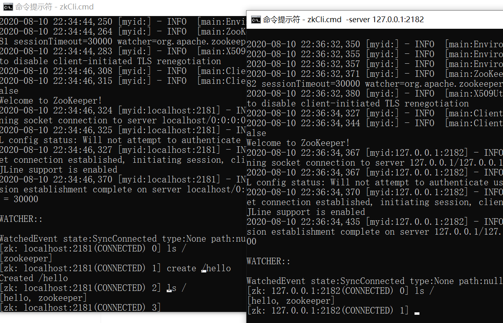

# ACL权限控制

## setAcl

acl权限设置：Access Control List（访问控制列表），用来控制znode节点访问权限的设置。基于scheme:id:permission方式进行权限控制.

### scheme认证模型

​	- world：开放模式，world表示全世界都可以访问（这是默认设置）

​	- ip：ip模式，限定客户端IP防问

​	- auth：用户密码认证模式，只有在会话中添加了认证才可以防问

​	- digest：与auth类似，区别在于auth用明文密码，而digest 用sha-1+base64加密后的密码。在实际使用中					digest更常见。

### permission权限位

​	- c：CREATE 可以创建子节点

​	- d：DELETE 可以删除子节点，只能删除下一级子节点

​	- r：READ 读取节点数据

​	- w：WRITE 可以使用set设置节点数据

​	- a：ADMIN 设置节点访问控制列表权限

基本语法：setAcl [-s] [-v version] [-R] path acl

### 示例

**world权限示例：**

先创建/hello节点：

```
create /helloacl
```

设置读写权限：

```
setAcl /helloacl world:anyone:rw
```


**IP权限示例：**
语法： setAcl <path> ip:<ip地址|地址段>:<权限位>

**auth模式示例:**
语法： 

1. setAcl <path> auth:<用户名>:<密码>:<权限位>
2. addauth digest <用户名>:<密码>

**digest 权限示例：**
语法： 

1. setAcl <path> digest :<用户名>:<密钥>:<权限位>
2. addauth digest <用户名>:<密码>

## getAcl

​	查看节点权限控制列表

​	基本语法：getAcl [-s] path

```
getAcl /helloacl
```


# Zookeeper集群

## 概述

相关名词解释:

- 集群

  一个特定领域的软件部署在多台服务器上并作为一个整体提供一类服务，这个整体称为集群。

  我们的zookeeper是可以部署在多台机器上共同组成一个整体提供集中配置服务。

- 伪集群

  同样也是将多个相同软件服务部署在一起作为一个整体对外提供服务，与集群稍微不一样的地方是伪集群的不同服务可以部署在同一台机器上，部署的应用服务用端口号（不同进程）来区分。

- 节点

  集群中的某一台机器可以称之为节点，或者是伪集群中的某一个具体端口号对应的那个应用也可以称之为集群中的节点。

- 分布式系统

  系统中的多个模块在不同服务器上部署，即可称为分布式系统，如Tomcat和数据库分别部署在不同的服务器上，或两个相同功能的Tomcat分别部署在不同服务器上。

## 1.集群架构部署

集群部署规划：

| ip        | clientPort | 数据同步端口 | 选举端口 | jetty内置端口 |
| :-------- | ---------- | ------------ | -------- | ------------- |
| 127.0.0.1 | 2181       | 2887         | 3887     | 8001          |
| 127.0.0.1 | 2182       | 2888         | 3888     | 8002          |
| 127.0.0.1 | 2183       | 2889         | 3889     | 8003          |

### linux环境

部署集群之前先将全部zk停用：

```
ps -ef |grep zookeeper |awk '{print $2}'|xargs kill -9
```

在/usr/local目录下新建zk_cluster目录：

```
cd /usr/local
mkdir zk_cluster
```

和前面单节点部署一致，先将gz文件解压然后拷贝到zk_cluster文件夹下并重命令为node1


进入node1目录新建data文件夹：


在data文件下创建文件myid,并写入1作为内容：


进入到conf目录拷贝zoo_sample.cfg文件重新命名为zoo.cfg

```
cd ../conf
cp zoo_sample.cfg zoo.cfg
```

修改zoo.cfg内容如下:

```
tickTime=2000
initLimit=10
syncLimit=5
dataDir=/usr/local/zk_cluster/node1/data
clientPort=2181
#集群配置 ip:数据同步端口:选举端口
server.1=127.0.0.1:2887:3887
server.2=127.0.0.1:2888:3888
server.3=127.0.0.1:2889:3889
#管理控制台内嵌jetty端口
admin.serverPort=8001
```

回到zk_cluster目录，将node1文件夹分别复制出node2、node3

```
cp -r node1/ node2
cp -r node1/ node3
```

**然后将node2/data/myid内容修改为2，node3/data/myid内容修改为3.**

修改node2/conf/zoo.cfg文件内容:

```
tickTime=2000
initLimit=10
syncLimit=5
dataDir=/usr/local/zk_cluster/node2/data
clientPort=2182
#集群配置 ip:数据同步端口:选举端口
server.1=127.0.0.1:2887:3887
server.2=127.0.0.1:2888:3888
server.3=127.0.0.1:2889:3889
#管理控制台内嵌jetty端口
admin.serverPort=8002
```

修改node3/conf/zoo.cfg文件内容:

```
tickTime=2000
initLimit=10
syncLimit=5
dataDir=/usr/local/zk_cluster/node3/data
clientPort=2183
#集群配置 ip:数据同步端口:选举端口
server.1=127.0.0.1:2887:3887
server.2=127.0.0.1:2888:3888
server.3=127.0.0.1:2889:3889
#管理控制台内嵌jerry端口
admin.serverPort=8003
```

以上node2和node3的zoo.cfg配置文件需要注意修改的点：dataDir、clientPort、admin.serverPort

到此配置已经全部完成，接下来分别启动三台zk：

```
/usr/local/zk_cluster/node1/bin/zkServer.sh start;
/usr/local/zk_cluster/node2/bin/zkServer.sh start;
/usr/local/zk_cluster/node3/bin/zkServer.sh start;
```


分别查看三台zk机器的状态：


### windows环境

将原解压目录apache-zookeeper-3.5.8-bin复制3份(里面的conf/zoo_sample.cfg复制到同级目录并重命名为zoo.cfg)并分别重命名为node1,node2,node3.


node1修改：

node1/data目录下新建myid文件，文件内容为1。


node1/conf/zoo.cfg文件内容修改:

```
tickTime=2000
initLimit=10
syncLimit=5
#目录改为你自己的目录
dataDir=C:/work/zk_cluster/node1/data
clientPort=2181
admin.serverPort=8001
#集群配置 ip:数据同步端口:选举端口
server.1=127.0.0.1:2887:3887
server.2=127.0.0.1:2888:3888
server.3=127.0.0.1:2889:3889
```

<font color="red">注意:dataDir路径不要包含中文,且路径地址使用'\\',不要使用'/'</font>

接下来node2修改:

node2/data目录下新建myid文件，文件内容为2。


node2/conf/zoo.cfg文件内容修改:

```
tickTime=2000
initLimit=10
syncLimit=5
#目录改为你自己的目录
dataDir=C:/work/zk_cluster/node2/data
clientPort=2182
admin.serverPort=8002
#集群配置 ip:数据同步端口:选举端口
server.1=127.0.0.1:2887:3887
server.2=127.0.0.1:2888:3888
server.3=127.0.0.1:2889:3889
```

node3的修改：

node3/data目录下新建myid文件，文件内容为3。


node3/conf/zoo.cfg文件内容修改:

```
tickTime=2000
initLimit=10
syncLimit=5
#目录改为你自己的目录
dataDir=C:/work/zk_cluster/node3/data
clientPort=2183
admin.serverPort=8003
#集群配置 ip:数据同步端口:选举端口
server.1=127.0.0.1:2887:3887
server.2=127.0.0.1:2888:3888
server.3=127.0.0.1:2889:3889
```

到此，配置文件就全部配置完毕。

分别到三个node的bin目录下双击zkServer.cmd启动zk服务:


验证集群可用：



## 2.zookeeper集群

### 2.1集群角色

| 角色         | 描述                                                         |
| :----------- | :----------------------------------------------------------- |
| **leader**   | 主节点，也称为领导者。用于数据的读写操作，通过选举产生，如果宕机将会选举新的主节点。 |
| **follower** | 子节点，又名追随者。用于数据的读取操作。同时也是主节点的备选节点，拥有投票权。 |
| **observer** | 次级子节点，又名观察者。用于读取数据，与follwer区别在于没有投票权，不能选为主节点。并且在计算集群可用状态时不会将observer计算入内。 |

**observer配置：**
在cfg配置集群服务器时加上observer后缀即可，如：

```
server.3=127.0.0.1:2889:3889:observer
```

### 2.2选举机制

zk的leader是通过投票机制进行选举的。

1.当得票数超过一半就结束，该节点就被选举为leader。

2.如果节点的事务ID不一致，那么最大的那个事务ID对应的节点数据最新最全，那么该节点直接选举为leader。

选举的触发时机：

1.初始化启动

2.超过半数以上的节点与leader节点发送心跳失败，无法建立连接。

### 2.3集群架构中的脑裂问题

架构说明：很多时候我们的集群节点会部署在不同的机房，这时整个集群只有一个leader。


网络在不稳定情况下两边机房出现不能互通，那么各个机房单独进行选举，则出现了两个集群，我们把这种情况称为集群的脑裂：


zookeeper解决脑裂问题的方案就是超过半数选举机制，这样发生了网络不相通只会有两种结果：1.集群不可用，2.集群可用，节点数损失（可用节点为leader所在机房的节点）。

### 2.4数据同步机制

数据主要靠leader写入，如果客户端集群环境下写入数据请求的是follower节点，那么follower节点会将该请求转发给leader节点写入。leader在写入数据后，提交事务之前先给所有follower发出提议，如果follower的ack确认超过半数则提交事务。


### 2.5ZAB一致性协议

Zab协议 的全称是 **Zookeeper Atomic Broadcast** （Zookeeper原子广播）。

**Zab协议原理**

Zab协议要求每个 Leader 都要经历三个阶段：**发现，同步，广播**。

- **发现**：要求zookeeper集群必须选举出一个 Leader 进程，同时 Leader 会维护一个 Follower 可用客户端列表。将来客户端可以和这些 Follower节点进行通信。
- **同步**：Leader 要负责将本身的数据与 Follower 完成同步，做到多副本存储。这样也是提现了CAP中的高可用和分区容错。Follower将队列中未处理完的请求消费完成后，写入本地事务日志中。
- **广播**：Leader 可以接受客户端新的事务Proposal请求，将新的Proposal请求广播给所有的 Follower。

**Zookeeper 是通过 Zab 协议来保证分布式事务的最终一致性**。

Zab 协议包括两种基本的模式：**崩溃恢复** 和 **消息广播**

上图的数据同步机制就是消息广播模式。那如果leader节点挂了、不可用，zk就会启动崩溃恢复模式，发起新的投票选举，选出新的leader，然后继续恢复到消息广播模式。

## 3.软件集群架构下数据一致性理论

一个集群往往会部署多个节点，根据节点的角色不一样，处理的一些功能也不一样。如我们的zookeeper集群中master节点处理的是数据的读写，slave节点主要负责读取。那数据分散在不同的机器上怎么样能够确保我随机性的访问不同节点给我的数据都是一致的呢？那这就涉及到我们分布式系统架构中两个非常重要的理论了。

### 3.1CAP原则


CAP原则又称CAP定理，指的是在一个分布式系统中， Consistency（一致性）、 Availability（可用性）、Partition tolerance（分区容错性），三者不可得兼。

CAP原则是NOSQL数据库的基石。

分布式系统的CAP理论：理论首先把分布式系统中的三个特性进行了如下归纳：

- 一致性（C）：在分布式系统中的所有数据备份，在同一时刻是否同样的值。（等同于所有节点访问同一份最新的数据副本）
- 可用性（A）：在集群中一部分节点故障后，集群整体是否还能响应客户端的读写请求。（对数据更新具备高可用性）
- 分区容忍性（P）：以实际效果而言，分区相当于对通信的时限要求。系统如果不能在时限内达成数据一致性，就意味着发生了分区的情况，必须就当前操作在C和A之间做出选择。

### 3.2 BASE理论

BASE是Basically Available（基本可用）、Soft state（软状态）和Eventually consistent（最终一致性）三个短语的简写，BASE是对CAP中一致性和可用性权衡的结果，其来源于对大规模互联网系统分布式实践的结论，是基于CAP定理逐步演化而来的，其核心思想是即使无法做到强一致性（Strong consistency），但每个应用都可以根据自身的业务特点，采用适当的方式来使系统达到最终一致性（Eventual consistency）。接下来我们着重对BASE中的三要素进行详细讲解。

**基本可用**

基本可用是指分布式系统在出现不可预知故障的时候，允许损失部分可用性——但请注意，这绝不等价于系统不可用，以下两个就是“基本可用”的典型例子。

- 响应时间上的损失：正常情况下，一个在线搜索引擎需要0.5秒内返回给用户相应的查询结果，但由于出现异常（比如系统部分机房发生断电或断网故障），查询结果的响应时间增加到了1~2秒。
- 功能上的损失：正常情况下，在一个电子商务网站上进行购物，消费者几乎能够顺利地完成每一笔订单，但是在一些节日大促购物高峰的时候，由于消费者的购物行为激增，为了保护购物系统的稳定性，部分消费者可能会被引导到一个降级页面。

**软状态**

弱状态也称为软状态，是指允许系统中的数据存在中间状态，并认为该中间状态的存在不会影响系统的整体可用性，即允许系统在不同节点的数据副本之间进行数据听不的过程存在延时。

**最终一致性**

最终一致性强调的是系统中所有的数据副本，在经过一段时间的同步后，最终能够达到一个一致的状态。因此，最终一致性的本质是需要系统保证最终数据能够达到一致，而不需要实时保证系统数据的强一致性